# Design Document: HR & Staff Management Module

## Overview

The HR & Staff Management Module is a comprehensive, no-code configurable system built on React frontend and Node.js/Prisma backend. The design follows a modular architecture with clear separation between the configuration engine, business logic, and data access layers. The system integrates with external biometric devices, the existing Finance module, and provides REST APIs for extensibility.

### Key Design Principles

1. **No-Code First**: All business rules, forms, and workflows are data-driven and configurable through UI
2. **Event-Driven Architecture**: System actions trigger events that can be consumed by other modules
3. **Audit-by-Design**: Every operation is logged immutably for compliance
4. **API-First**: All functionality exposed through REST APIs for integration
5. **Multi-Tenancy**: Campus-level data isolation with shared configuration capabilities

## Architecture

### High-Level Architecture

```mermaid
graph TB
    subgraph "Frontend Layer (React)"
        UI[React Components]
        FormBuilder[Form Builder UI]
        WorkflowBuilder[Workflow Builder UI]
    end
    
    subgraph "API Layer (Node.js/Express)"
        API[REST API Controllers]
        Auth[Authentication/Authorization]
        Validation[Request Validation]
    end
    
    subgraph "Business Logic Layer"
        RoleService[Role & Org Service]
        RecruitmentService[Recruitment Service]
        OnboardingService[Onboarding Service]
        AttendanceService[Attendance Service]
        LeaveService[Leave Service]
        PayrollService[Payroll Service]
        AppraisalService[Appraisal Service]
        ExitService[Exit Service]
        ConfigEngine[Configuration Engine]
        WorkflowEngine[Workflow Engine]
    end
    
    subgraph "Integration Layer"
        BiometricAdapter[Biometric Device Adapter]
        FinanceAdapter[Finance Module Adapter]
        NotificationService[SMS/Email Service]
    end
    
    subgraph "Data Layer (Prisma/PostgreSQL)"
        DB[(PostgreSQL Database)]
        AuditLog[(Audit Log)]
    end
    
    UI --> API
    FormBuilder --> API
    WorkflowBuilder --> API
    API --> Auth
    API --> Validation
    API --> RoleService
    API --> RecruitmentService

    API --> OnboardingService
    API --> AttendanceService
    API --> LeaveService
    API --> PayrollService
    API --> AppraisalService
    API --> ExitService
    
    RoleService --> ConfigEngine
    OnboardingService --> ConfigEngine
    LeaveService --> WorkflowEngine
    PayrollService --> WorkflowEngine
    ExitService --> WorkflowEngine
    
    AttendanceService --> BiometricAdapter
    PayrollService --> FinanceAdapter
    WorkflowEngine --> NotificationService
    
    RoleService --> DB
    RecruitmentService --> DB
    OnboardingService --> DB
    AttendanceService --> DB
    LeaveService --> DB
    PayrollService --> DB
    AppraisalService --> DB
    ExitService --> DB
    ConfigEngine --> DB
    
    Auth --> AuditLog
    RoleService --> AuditLog
    RecruitmentService --> AuditLog
    OnboardingService --> AuditLog
    AttendanceService --> AuditLog
    LeaveService --> AuditLog
    PayrollService --> AuditLog
    AppraisalService --> AuditLog
    ExitService --> AuditLog
```



### Technology Stack

- **Frontend**: React 18+, React Router, Redux/Context API for state management
- **Backend**: Node.js with Express.js framework
- **ORM**: Prisma for type-safe database access
- **Database**: PostgreSQL 14+
- **Authentication**: JWT tokens with refresh token rotation
- **File Storage**: Local filesystem or S3-compatible storage
- **Caching**: Redis for session management and performance
- **Queue**: Bull/BullMQ for async job processing (payroll, notifications)

## Components and Interfaces

### 1. Role & Organization Management

#### Components

**RoleService**
- Manages CRUD operations for roles and permissions
- Handles role hierarchy and inheritance
- Validates role assignments

**OrganizationService**
- Manages organizational units and campus structures
- Handles parent-child relationships
- Validates organizational hierarchy

#### Key Interfaces

```typescript
interface Role {
  id: string;
  name: string;
  description: string;
  permissions: Permission[];
  hierarchy: 'senior' | 'junior' | 'standard';
  campusId: string;
  isActive: boolean;
  createdAt: Date;
  updatedAt: Date;
}

interface Permission {
  id: string;
  resource: string;  // e.g., 'staff', 'leave', 'payroll'
  action: string;    // e.g., 'create', 'read', 'update', 'delete'
  scope: 'own' | 'unit' | 'campus' | 'all';
}

interface OrganizationUnit {
  id: string;
  name: string;
  type: 'department' | 'unit' | 'sub-unit';
  parentId: string | null;
  headId: string | null;  // Staff member ID
  campusId: string;
  isActive: boolean;
}

interface StaffRole {
  staffId: string;
  roleId: string;
  organizationUnitId: string;
  isPrimary: boolean;
  effectiveFrom: Date;
  effectiveTo: Date | null;
}
```

### 2. Recruitment & CV Management

#### Components

**RecruitmentService**
- Manages job postings and vacancies
- Handles CV submissions and talent pool
- Manages ATS stages and candidate progression

**InterviewService**
- Schedules interviews
- Records interview scores and feedback
- Generates interview reports

**ContractService**
- Manages contract templates
- Generates contracts from templates
- Handles contract versioning and renewals

#### Key Interfaces

```typescript
interface JobPosting {
  id: string;
  title: string;
  description: string;
  requirements: string;
  contractType: 'permanent' | 'contract' | 'part-time' | 'temporary';
  campusId: string;
  organizationUnitId: string;
  status: 'draft' | 'published' | 'closed';
  publishedAt: Date | null;
  closedAt: Date | null;
}

interface Candidate {
  id: string;
  firstName: string;
  lastName: string;
  email: string;
  phone: string;
  cvFileUrl: string;
  skills: string[];
  experience: number;  // years
  education: string;
  jobPostingId: string;
  currentStage: string;
  status: 'active' | 'hired' | 'rejected' | 'withdrawn';
}

interface ATSStage {
  id: string;
  name: string;
  order: number;
  campusId: string;
  isDefault: boolean;
}

interface CandidateStageHistory {
  id: string;
  candidateId: string;
  stageId: string;
  enteredAt: Date;
  exitedAt: Date | null;
  movedBy: string;  // User ID
  notes: string;
}

interface Interview {
  id: string;
  candidateId: string;
  interviewerId: string;
  scheduledAt: Date;
  duration: number;  // minutes
  location: string;
  type: 'phone' | 'video' | 'in-person';
  status: 'scheduled' | 'completed' | 'cancelled';
  score: number | null;
  feedback: string | null;
}

interface ContractTemplate {
  id: string;
  name: string;
  content: string;  // Template with placeholders
  contractType: string;
  campusId: string;
  version: number;
}

interface Contract {
  id: string;
  candidateId: string;
  templateId: string;
  content: string;  // Rendered content
  startDate: Date;
  endDate: Date | null;
  status: 'draft' | 'sent' | 'signed' | 'expired';
  version: number;
}
```

### 3. Onboarding & Form Builder

#### Components

**FormBuilderService**
- Manages form definitions and field configurations
- Handles conditional logic evaluation
- Validates form submissions

**OnboardingService**
- Assigns forms to new staff
- Tracks form completion status
- Manages document uploads and expiry

**DocumentService**
- Stores and retrieves documents
- Tracks document metadata and expiry
- Sends expiry alerts

#### Key Interfaces

```typescript
interface FormDefinition {
  id: string;
  name: string;
  description: string;
  fields: FormField[];
  campusId: string;
  assignedToRoles: string[];
  isActive: boolean;
  version: number;
}

interface FormField {
  id: string;
  name: string;
  label: string;
  type: 'text' | 'number' | 'dropdown' | 'file' | 'date' | 'checkbox' | 'radio';
  required: boolean;
  options: string[] | null;  // For dropdown/radio
  validationRules: ValidationRule[];
  conditionalLogic: ConditionalRule | null;
  order: number;
}

interface ValidationRule {
  type: 'regex' | 'min' | 'max' | 'minLength' | 'maxLength';
  value: string | number;
  errorMessage: string;
}

interface ConditionalRule {
  fieldId: string;
  operator: 'equals' | 'notEquals' | 'contains' | 'greaterThan' | 'lessThan';
  value: any;
  action: 'show' | 'hide' | 'require';
}

interface FormSubmission {
  id: string;
  formDefinitionId: string;
  staffId: string;
  data: Record<string, any>;
  status: 'draft' | 'submitted' | 'approved' | 'rejected';
  submittedAt: Date | null;
  version: number;
}

interface Document {
  id: string;
  staffId: string;
  type: string;  // 'id', 'certificate', 'medical', 'experience'
  fileUrl: string;
  fileName: string;
  uploadedAt: Date;
  expiryDate: Date | null;
  status: 'active' | 'expired' | 'replaced';
}
```


### 4. Staff Master Record

#### Components

**StaffService**
- Manages staff master records
- Handles CRUD operations with audit logging
- Enforces role-based access control

**StaffHistoryService**
- Tracks employment history
- Records position changes
- Maintains education and certification records

#### Key Interfaces

```typescript
interface StaffMember {
  id: string;
  employeeNumber: string;
  firstName: string;
  lastName: string;
  email: string;
  phone: string;
  dateOfBirth: Date;
  gender: 'male' | 'female' | 'other';
  address: string;
  emergencyContact: EmergencyContact;
  campusId: string;
  hireDate: Date;
  contractType: string;
  status: 'active' | 'on-leave' | 'suspended' | 'exited';
  profilePhotoUrl: string | null;
}

interface EmergencyContact {
  name: string;
  relationship: string;
  phone: string;
  email: string;
}

interface EmploymentHistory {
  id: string;
  staffId: string;
  position: string;
  organizationUnitId: string;
  startDate: Date;
  endDate: Date | null;
  contractType: string;
  salary: number;
  changeReason: string;
}

interface Education {
  id: string;
  staffId: string;
  degree: string;
  institution: string;
  fieldOfStudy: string;
  graduationYear: number;
  certificateUrl: string | null;
}

interface Certification {
  id: string;
  staffId: string;
  name: string;
  issuingOrganization: string;
  issueDate: Date;
  expiryDate: Date | null;
  certificateUrl: string;
}
```

### 5. Attendance Management

#### Components

**AttendanceService**
- Records attendance from multiple sources
- Calculates work hours and overtime
- Generates attendance summaries

**BiometricAdapter**
- Integrates with biometric devices
- Handles offline synchronization
- Manages device registration

**AttendanceRuleEngine**
- Evaluates late/early rules
- Calculates grace periods
- Applies shift-specific rules

#### Key Interfaces

```typescript
interface AttendanceRecord {
  id: string;
  staffId: string;
  date: Date;
  clockIn: Date | null;
  clockOut: Date | null;
  workHours: number;
  overtimeHours: number;
  status: 'present' | 'absent' | 'late' | 'half-day' | 'on-leave';
  source: 'biometric' | 'rfid' | 'qr' | 'mobile' | 'manual';
  deviceId: string | null;
  location: GeoLocation | null;
  isManuallyAdjusted: boolean;
  adjustmentReason: string | null;
  adjustedBy: string | null;
}

interface GeoLocation {
  latitude: number;
  longitude: number;
  accuracy: number;
}

interface WorkShift {
  id: string;
  name: string;
  startTime: string;  // HH:mm format
  endTime: string;
  breakDuration: number;  // minutes
  gracePeriod: number;  // minutes
  campusId: string;
  applicableRoles: string[];
}

interface AttendanceRule {
  id: string;
  name: string;
  type: 'late' | 'early-departure' | 'overtime' | 'weekend' | 'holiday';
  condition: string;  // JSON expression
  action: string;  // JSON action definition
  campusId: string;
  priority: number;
}

interface AttendanceSummary {
  staffId: string;
  month: number;
  year: number;
  totalDays: number;
  presentDays: number;
  absentDays: number;
  lateDays: number;
  halfDays: number;
  leaveDays: number;
  totalWorkHours: number;
  totalOvertimeHours: number;
}

interface BiometricDevice {
  id: string;
  name: string;
  type: 'fingerprint' | 'face' | 'rfid' | 'qr';
  ipAddress: string;
  port: number;
  campusId: string;
  location: string;
  status: 'online' | 'offline' | 'error';
  lastSyncAt: Date | null;
}
```

### 6. Leave Management

#### Components

**LeaveService**
- Manages leave requests and approvals
- Calculates leave balances
- Enforces leave policies

**LeaveBalanceCalculator**
- Computes accruals based on policies
- Handles carry-forward logic
- Adjusts for employment duration

**LeaveWorkflowEngine**
- Routes requests through approval chains
- Sends notifications at each stage
- Handles escalations

#### Key Interfaces

```typescript
interface LeaveType {
  id: string;
  name: string;
  description: string;
  campusId: string;
  isActive: boolean;
}

interface LeavePolicy {
  id: string;
  leaveTypeId: string;
  accrualRate: number;  // days per month
  maxBalance: number;
  carryForwardLimit: number;
  applicableGender: 'all' | 'male' | 'female';
  applicableRoles: string[];
  requiresApproval: boolean;
  campusId: string;
}

interface LeaveBalance {
  id: string;
  staffId: string;
  leaveTypeId: string;
  year: number;
  accrued: number;
  used: number;
  carriedForward: number;
  adjusted: number;
  available: number;
}

interface LeaveRequest {
  id: string;
  staffId: string;
  leaveTypeId: string;
  startDate: Date;
  endDate: Date;
  days: number;
  reason: string;
  status: 'pending' | 'approved' | 'rejected' | 'cancelled';
  submittedAt: Date;
  currentApproverId: string | null;
  approvalHistory: ApprovalStep[];
}

interface ApprovalStep {
  approverId: string;
  action: 'approved' | 'rejected';
  comments: string;
  timestamp: Date;
}
```

### 7. Payroll Integration

#### Components

**PayrollService**
- Orchestrates payroll processing
- Integrates attendance and leave data
- Generates payslips

**SalaryCalculator**
- Computes gross and net salary
- Applies deductions and allowances
- Calculates taxes

**PayrollWorkflowEngine**
- Routes payroll for approval
- Handles corrections and adjustments
- Integrates with Finance module

#### Key Interfaces

```typescript
interface SalaryStructure {
  id: string;
  staffId: string;
  basicSalary: number;
  allowances: SalaryComponent[];
  deductions: SalaryComponent[];
  overtimeRate: number;
  currency: string;
  effectiveFrom: Date;
  effectiveTo: Date | null;
}

interface SalaryComponent {
  name: string;
  type: 'fixed' | 'percentage' | 'variable';
  amount: number;
  isRecurring: boolean;
  isTaxable: boolean;
}

interface PayrollRun {
  id: string;
  month: number;
  year: number;
  campusId: string;
  status: 'draft' | 'processing' | 'pending-approval' | 'approved' | 'paid';
  totalStaff: number;
  totalGross: number;
  totalDeductions: number;
  totalNet: number;
  processedBy: string;
  processedAt: Date;
  approvedBy: string | null;
  approvedAt: Date | null;
}

interface Payslip {
  id: string;
  payrollRunId: string;
  staffId: string;
  month: number;
  year: number;
  basicSalary: number;
  allowances: SalaryComponent[];
  deductions: SalaryComponent[];
  overtimePay: number;
  absencePenalty: number;
  latePenalty: number;
  grossSalary: number;
  netSalary: number;
  payableDays: number;
  generatedAt: Date;
}

interface PayrollRule {
  id: string;
  name: string;
  type: 'absence-penalty' | 'late-penalty' | 'overtime' | 'bonus';
  formula: string;  // Mathematical expression
  campusId: string;
  isActive: boolean;
}
```


### 8. Performance & Appraisal

#### Components

**AppraisalService**
- Manages appraisal cycles
- Collects evaluations from multiple sources
- Aggregates scores

**KPIService**
- Manages KPI definitions
- Assigns KPIs to roles
- Tracks KPI achievement

**EvaluationEngine**
- Calculates weighted scores
- Generates performance reports
- Identifies trends

#### Key Interfaces

```typescript
interface KPI {
  id: string;
  name: string;
  description: string;
  category: 'academic' | 'non-academic' | 'behavioral' | 'administrative';
  measurementCriteria: string;
  campusId: string;
}

interface RoleKPI {
  roleId: string;
  kpiId: string;
  weightage: number;  // percentage
  targetValue: number | null;
}

interface AppraisalCycle {
  id: string;
  name: string;
  type: 'annual' | 'term' | 'probation' | 'mid-year';
  startDate: Date;
  endDate: Date;
  evaluationDeadline: Date;
  campusId: string;
  status: 'draft' | 'active' | 'completed';
}

interface Evaluation {
  id: string;
  appraisalCycleId: string;
  staffId: string;
  evaluatorId: string;
  evaluatorType: 'self' | 'supervisor' | 'peer';
  kpiScores: KPIScore[];
  overallComments: string;
  submittedAt: Date;
  status: 'draft' | 'submitted';
}

interface KPIScore {
  kpiId: string;
  score: number;  // 1-5 scale
  comments: string;
  evidence: string | null;
}

interface AppraisalResult {
  id: string;
  appraisalCycleId: string;
  staffId: string;
  selfScore: number;
  supervisorScore: number;
  peerScore: number | null;
  finalScore: number;
  rating: 'outstanding' | 'exceeds' | 'meets' | 'needs-improvement' | 'unsatisfactory';
  strengths: string;
  areasForImprovement: string;
  developmentPlan: string;
  generatedAt: Date;
}
```

### 9. Discipline & Compliance

#### Components

**DisciplineService**
- Records incidents and actions
- Generates warning letters
- Tracks disciplinary history

**ComplianceService**
- Manages policy documents
- Tracks acknowledgments
- Generates compliance reports

#### Key Interfaces

```typescript
interface DisciplinaryIncident {
  id: string;
  staffId: string;
  reportedBy: string;
  incidentDate: Date;
  description: string;
  category: 'misconduct' | 'performance' | 'attendance' | 'policy-violation' | 'other';
  severity: 'minor' | 'moderate' | 'major' | 'critical';
  witnesses: string[];
  evidenceUrls: string[];
  status: 'reported' | 'investigating' | 'resolved' | 'closed';
}

interface DisciplinaryAction {
  id: string;
  incidentId: string;
  actionType: 'verbal-warning' | 'written-warning' | 'suspension' | 'termination' | 'other';
  actionDate: Date;
  description: string;
  duration: number | null;  // days for suspension
  letterUrl: string | null;
  issuedBy: string;
  acknowledgedBy: string | null;
  acknowledgedAt: Date | null;
}

interface PolicyDocument {
  id: string;
  title: string;
  description: string;
  documentUrl: string;
  version: number;
  publishedAt: Date;
  requiresAcknowledgment: boolean;
  applicableRoles: string[];
  campusId: string;
  status: 'draft' | 'published' | 'archived';
}

interface PolicyAcknowledgment {
  id: string;
  policyDocumentId: string;
  staffId: string;
  acknowledgedAt: Date;
  ipAddress: string;
  userAgent: string;
}
```

### 10. Training & Development

#### Components

**TrainingService**
- Manages training requests and catalog
- Tracks training completion
- Calculates training costs

**SkillGapAnalyzer**
- Compares required vs actual skills
- Identifies training needs
- Generates development plans

#### Key Interfaces

```typescript
interface TrainingCourse {
  id: string;
  name: string;
  provider: string;
  description: string;
  duration: number;  // hours
  cost: number;
  category: string;
  campusId: string;
}

interface TrainingRequest {
  id: string;
  staffId: string;
  courseId: string | null;
  courseName: string;
  justification: string;
  preferredDates: Date[];
  estimatedCost: number;
  status: 'pending' | 'approved' | 'rejected' | 'completed';
  submittedAt: Date;
  approvalHistory: ApprovalStep[];
}

interface TrainingRecord {
  id: string;
  staffId: string;
  courseId: string;
  completionDate: Date;
  certificateUrl: string | null;
  score: number | null;
  feedback: string;
  cost: number;
}

interface SkillRequirement {
  roleId: string;
  skillName: string;
  proficiencyLevel: 'basic' | 'intermediate' | 'advanced' | 'expert';
  isMandatory: boolean;
}

interface StaffSkill {
  staffId: string;
  skillName: string;
  proficiencyLevel: string;
  acquiredDate: Date;
  certificationUrl: string | null;
}
```

### 11. Exit Management

#### Components

**ExitService**
- Manages resignation process
- Generates clearance checklists
- Calculates final settlements

**ClearanceService**
- Tracks clearance items
- Validates completion
- Generates clearance certificates

**ExitInterviewService**
- Conducts exit interviews
- Collects feedback
- Generates exit reports

#### Key Interfaces

```typescript
interface Resignation {
  id: string;
  staffId: string;
  submittedAt: Date;
  lastWorkingDay: Date;
  reason: string;
  status: 'pending' | 'approved' | 'rejected' | 'withdrawn';
  approvedBy: string | null;
  approvedAt: Date | null;
}

interface ClearanceChecklist {
  id: string;
  resignationId: string;
  items: ClearanceItem[];
  status: 'pending' | 'in-progress' | 'completed';
  completedAt: Date | null;
}

interface ClearanceItem {
  id: string;
  name: string;
  description: string;
  responsibleDepartment: string;
  status: 'pending' | 'completed' | 'not-applicable';
  completedBy: string | null;
  completedAt: Date | null;
  notes: string;
}

interface ExitInterview {
  id: string;
  resignationId: string;
  conductedBy: string;
  conductedAt: Date;
  responses: Record<string, any>;
  overallFeedback: string;
  wouldRehire: boolean;
}

interface FinalSettlement {
  id: string;
  resignationId: string;
  pendingSalary: number;
  leaveEncashment: number;
  bonuses: number;
  deductions: number;
  netAmount: number;
  calculatedAt: Date;
  approvedBy: string | null;
  paidAt: Date | null;
}

interface ExperienceLetter {
  id: string;
  resignationId: string;
  content: string;
  generatedAt: Date;
  issuedBy: string;
  letterUrl: string;
}
```

### 12. Configuration Engine

#### Components

**ConfigurationService**
- Manages system configurations
- Handles version control
- Provides rollback capability

**WorkflowEngine**
- Evaluates workflow definitions
- Routes items through approval chains
- Sends notifications

**NotificationService**
- Sends email and SMS notifications
- Renders templates with variables
- Tracks delivery status

#### Key Interfaces

```typescript
interface WorkflowDefinition {
  id: string;
  name: string;
  entityType: string;  // 'leave', 'training', 'payroll', etc.
  stages: WorkflowStage[];
  campusId: string;
  isActive: boolean;
  version: number;
}

interface WorkflowStage {
  id: string;
  name: string;
  order: number;
  approverType: 'role' | 'specific-user' | 'unit-head' | 'dynamic';
  approverValue: string;  // Role ID, User ID, or expression
  condition: string | null;  // JSON condition
  escalationHours: number | null;
  escalationTo: string | null;
}

interface WorkflowInstance {
  id: string;
  workflowDefinitionId: string;
  entityType: string;
  entityId: string;
  currentStageId: string;
  status: 'pending' | 'approved' | 'rejected' | 'cancelled';
  history: WorkflowHistory[];
  createdAt: Date;
}

interface WorkflowHistory {
  stageId: string;
  approverId: string;
  action: 'approved' | 'rejected' | 'escalated';
  comments: string;
  timestamp: Date;
}

interface NotificationTemplate {
  id: string;
  name: string;
  channel: 'email' | 'sms' | 'both';
  subject: string;
  body: string;  // Template with {{variables}}
  campusId: string;
}

interface NotificationLog {
  id: string;
  templateId: string;
  recipientId: string;
  channel: string;
  subject: string;
  body: string;
  status: 'pending' | 'sent' | 'failed';
  sentAt: Date | null;
  error: string | null;
}
```

### 13. Audit & Security

#### Components

**AuditService**
- Logs all system actions
- Provides immutable audit trail
- Generates audit reports

**AuthorizationService**
- Enforces role-based access control
- Validates permissions
- Handles multi-factor authentication

#### Key Interfaces

```typescript
interface AuditLog {
  id: string;
  userId: string;
  action: string;  // 'create', 'read', 'update', 'delete'
  entityType: string;
  entityId: string;
  oldValue: any | null;
  newValue: any | null;
  ipAddress: string;
  userAgent: string;
  timestamp: Date;
  hash: string;  // Cryptographic hash for integrity
}

interface UserSession {
  id: string;
  userId: string;
  token: string;
  refreshToken: string;
  expiresAt: Date;
  ipAddress: string;
  userAgent: string;
  createdAt: Date;
  lastActivityAt: Date;
}

interface PermissionCheck {
  userId: string;
  resource: string;
  action: string;
  entityId: string | null;
  campusId: string;
}
```

## Data Models

### Database Schema (Prisma)

The system uses Prisma ORM with PostgreSQL. Key schema considerations:

1. **Multi-tenancy**: All tables include `campusId` for data isolation
2. **Soft Deletes**: Critical tables use `isActive` or `status` instead of hard deletes
3. **Audit Trail**: Timestamps (`createdAt`, `updatedAt`) on all tables
4. **Versioning**: Configuration tables include `version` field
5. **Relationships**: Proper foreign keys with cascade rules

### Key Database Tables

- `Campus` - Multi-campus support
- `Role` - Dynamic role definitions
- `Permission` - Granular permissions
- `OrganizationUnit` - Organizational structure
- `StaffMember` - Core staff records
- `StaffRole` - Many-to-many staff-role mapping
- `JobPosting` - Recruitment postings
- `Candidate` - CV pool
- `ATSStage` - Recruitment stages
- `CandidateStageHistory` - Candidate progression
- `Interview` - Interview records
- `Contract` - Employment contracts
- `FormDefinition` - Dynamic forms
- `FormSubmission` - Form responses
- `Document` - File storage metadata
- `AttendanceRecord` - Daily attendance
- `WorkShift` - Shift definitions
- `AttendanceRule` - Attendance rules
- `BiometricDevice` - Device registry
- `LeaveType` - Leave categories
- `LeavePolicy` - Leave rules
- `LeaveBalance` - Staff leave balances
- `LeaveRequest` - Leave applications
- `SalaryStructure` - Salary definitions
- `PayrollRun` - Monthly payroll batches
- `Payslip` - Individual payslips
- `KPI` - Performance indicators
- `AppraisalCycle` - Evaluation periods
- `Evaluation` - Performance evaluations
- `AppraisalResult` - Final scores
- `DisciplinaryIncident` - Incidents
- `DisciplinaryAction` - Actions taken
- `PolicyDocument` - Policies
- `PolicyAcknowledgment` - Staff acknowledgments
- `TrainingCourse` - Training catalog
- `TrainingRequest` - Training applications
- `TrainingRecord` - Completed training
- `Resignation` - Exit requests
- `ClearanceChecklist` - Exit clearances
- `ExitInterview` - Exit feedback
- `FinalSettlement` - Exit payments
- `WorkflowDefinition` - Workflow configs
- `WorkflowInstance` - Active workflows
- `NotificationTemplate` - Message templates
- `NotificationLog` - Sent notifications
- `AuditLog` - System audit trail
- `UserSession` - Active sessions


## Correctness Properties

*A property is a characteristic or behavior that should hold true across all valid executions of a system—essentially, a formal statement about what the system should do. Properties serve as the bridge between human-readable specifications and machine-verifiable correctness guarantees.*

### Property Reflection

After analyzing all acceptance criteria, I've identified the following testable properties. To eliminate redundancy, I've combined related properties and removed those that are subsumed by others:

**Redundancy Analysis:**
- Multiple audit logging requirements (1.10, 4.10, 5.12, 9.9, 11.11) can be combined into a single comprehensive audit property
- Role and organization CRUD operations (1.1-1.7) can be combined into organizational structure properties
- Form field support and validation (3.2, 3.3, 3.10) can be combined into form validation properties
- Payroll calculations (7.3-7.7) can be combined into a comprehensive payroll calculation property
- Various configuration requirements can be combined into configuration management properties

### Core Properties

**Property 1: Role Creation and Assignment**
*For any* set of unique role names and permission sets, the system should successfully create all roles and allow assignment of those permissions, and any staff member should be assignable to multiple roles simultaneously.
**Validates: Requirements 1.1, 1.2, 1.3**

**Property 2: Organizational Hierarchy Integrity**
*For any* organizational structure with parent-child relationships, the system should maintain referential integrity such that deleting a parent unit or role that has children or assigned staff members is prevented.
**Validates: Requirements 1.5, 1.9**

**Property 3: Cascading Updates**
*For any* role or organization unit modification, all associated staff member records should be updated immediately to reflect the changes.
**Validates: Requirements 1.8**

**Property 4: Multi-Campus Data Isolation**
*For any* two different campuses, data created in one campus should not be accessible from the other campus unless explicitly shared (like CV_Pool).
**Validates: Requirements 1.7, 15.8, 15.9**

**Property 5: Comprehensive Audit Logging**
*For any* create, update, or delete operation on critical entities (roles, staff, attendance, leave, payroll, discipline, exit), an immutable audit log entry should be created with user, timestamp, old value, and new value.
**Validates: Requirements 1.10, 4.10, 5.12, 9.9, 11.11, 13.4, 13.5**

**Property 6: CV Storage and Categorization**
*For any* submitted CV with job type, the system should store it in the CV_Pool and correctly categorize it, making it searchable by the specified job type.
**Validates: Requirements 2.3, 2.4**

**Property 7: ATS Stage Transition Tracking**
*For any* candidate movement between ATS stages, the system should record the transition with timestamp, user, and stage information in the candidate's history.
**Validates: Requirements 2.6**

**Property 8: Contract Versioning**
*For any* contract document modification, the system should create a new version while preserving all previous versions, maintaining a complete version history.
**Validates: Requirements 2.11**

**Property 9: Form Field Type Support**
*For any* form definition containing all supported field types (text, number, dropdown, file, date, checkbox, radio), the system should successfully create the form and allow submission with valid data for each field type.
**Validates: Requirements 3.2**

**Property 10: Conditional Field Logic**
*For any* form with conditional rules, when the condition is met, the dependent field should be shown/hidden/required according to the rule definition.
**Validates: Requirements 3.4**

**Property 11: Mandatory Field Validation**
*For any* form submission with mandatory fields, if any mandatory field is empty or invalid, the system should reject the submission and provide specific error messages.
**Validates: Requirements 3.10**

**Property 12: Document Expiry Tracking**
*For any* uploaded document with an expiry date, the system should track the expiry date and make it queryable for generating expiry reports.
**Validates: Requirements 3.8**

**Property 13: Role-Based Access Control**
*For any* user attempting to access a resource, the system should grant or deny access based on the user's assigned roles and the permissions associated with those roles.
**Validates: Requirements 4.11, 9.10, 13.1**

**Property 14: Attendance Duplicate Prevention**
*For any* staff member and date, the system should prevent creation of duplicate attendance records, allowing only one attendance entry per staff per day.
**Validates: Requirements 5.13**

**Property 15: Attendance Summary Calculation**
*For any* staff member and month, the attendance summary should correctly aggregate all attendance records for that period, calculating total present days, absent days, late days, work hours, and overtime hours.
**Validates: Requirements 5.10**

**Property 16: Geo-Fencing Validation**
*For any* mobile attendance submission, if GPS coordinates are outside the configured geo-fence boundary, the system should reject the attendance entry.
**Validates: Requirements 5.2**

**Property 17: Offline Attendance Synchronization**
*For any* attendance records queued while a device is offline, when connectivity is restored, all queued records should be synchronized to the server without data loss.
**Validates: Requirements 5.3**

**Property 18: Leave Balance Calculation**
*For any* staff member with configured leave policies, the system should automatically calculate leave balances based on accrual rate, employment duration, used leave, and carry-forward, such that available balance equals accrued + carried forward + adjusted - used.
**Validates: Requirements 6.4**

**Property 19: Leave Request Validation**
*For any* leave request, if the requested days exceed the available balance, the system should reject the request with an insufficient balance error.
**Validates: Requirements 6.5**

**Property 20: Leave Balance Deduction**
*For any* approved leave request, the system should deduct the leave days from the staff member's available balance for that leave type.
**Validates: Requirements 6.7**

**Property 21: Leave Conflict Detection**
*For any* leave request, if the requested dates overlap with already approved leave for the same staff member, the system should reject the request with a conflict error.
**Validates: Requirements 6.11**

**Property 22: Payroll Calculation Accuracy**
*For any* payroll run, the calculated payable days should equal the number of present days from attendance records, overtime pay should equal overtime hours multiplied by overtime rate, and net salary should equal gross salary minus all deductions plus all allowances.
**Validates: Requirements 7.3, 7.4, 7.5, 7.6, 7.7**

**Property 23: Payslip Generation**
*For any* approved payroll run, the system should generate exactly one payslip for each staff member included in the payroll run.
**Validates: Requirements 7.9**

**Property 24: Payroll-Finance Integration**
*For any* approved payroll run, the system should create corresponding expense records in the Finance module with matching amounts.
**Validates: Requirements 7.11**

**Property 25: Appraisal Score Aggregation**
*For any* completed appraisal with self, supervisor, and optional peer evaluations, the final score should be calculated as the weighted average of all evaluation scores based on configured weightage.
**Validates: Requirements 8.8**

**Property 26: Policy Acknowledgment Tracking**
*For any* published policy requiring acknowledgment, the system should track which staff members have acknowledged it and which haven't, allowing generation of compliance reports.
**Validates: Requirements 9.7, 9.8**

**Property 27: Exit Clearance Validation**
*For any* resignation, the system should prevent final settlement calculation until all clearance checklist items are marked as complete.
**Validates: Requirements 11.7**

**Property 28: Final Settlement Calculation**
*For any* completed exit clearance, the final settlement should equal pending salary plus leave encashment plus bonuses minus deductions.
**Validates: Requirements 11.8**

**Property 29: Account Deactivation with Data Preservation**
*For any* finalized exit, the staff member's account should be deactivated (preventing login) while all historical records (attendance, leave, payroll, performance) remain accessible for reporting.
**Validates: Requirements 11.10**

**Property 30: Configuration Hot-Reload**
*For any* configuration change (workflow, form, rule), the system should apply the change immediately without requiring restart, and subsequent operations should use the new configuration.
**Validates: Requirements 12.10**

**Property 31: Configuration Rollback**
*For any* configuration with version history, rolling back to a previous version should restore the exact configuration state from that version.
**Validates: Requirements 12.11**

**Property 32: Input Sanitization**
*For any* user input containing potentially malicious content (SQL injection, XSS, CSRF), the system should sanitize or reject the input, preventing the attack.
**Validates: Requirements 13.11**

**Property 33: API Rate Limiting**
*For any* API client exceeding the configured rate limit, the system should reject subsequent requests with a rate limit error until the time window resets.
**Validates: Requirements 14.10**

**Property 34: Data Import/Export Round-Trip**
*For any* valid collection of staff member records, exporting to CSV/Excel then importing the exported file should produce equivalent records with all data preserved.
**Validates: Requirements 16.6**

**Property 35: Import Validation and Error Reporting**
*For any* import file containing invalid data, the system should reject the import and return descriptive error messages indicating the specific row, column, and validation failure.
**Validates: Requirements 16.3, 16.7**

## Error Handling

### Error Categories

1. **Validation Errors**: Invalid input data, missing required fields, format errors
2. **Business Rule Violations**: Insufficient leave balance, duplicate attendance, clearance incomplete
3. **Authorization Errors**: Insufficient permissions, cross-campus access attempts
4. **Integration Errors**: Biometric device offline, Finance module unavailable, notification service failure
5. **System Errors**: Database connection failure, file storage unavailable, unexpected exceptions

### Error Handling Strategy

**Validation Errors:**
- Return HTTP 400 with detailed error messages
- Include field-level errors for form submissions
- Provide suggestions for correction

**Business Rule Violations:**
- Return HTTP 422 with business rule explanation
- Include current state information (e.g., available balance)
- Log violation attempts for audit

**Authorization Errors:**
- Return HTTP 403 for insufficient permissions
- Return HTTP 401 for authentication failures
- Log unauthorized access attempts
- Never reveal existence of resources user can't access

**Integration Errors:**
- Implement retry logic with exponential backoff
- Queue operations for later processing when possible
- Return HTTP 503 for temporary unavailability
- Provide fallback mechanisms (e.g., manual attendance entry)
- Alert administrators for prolonged failures

**System Errors:**
- Return HTTP 500 with generic error message to users
- Log detailed error information for debugging
- Implement circuit breakers for external dependencies
- Provide graceful degradation where possible

### Error Response Format

```typescript
interface ErrorResponse {
  error: {
    code: string;
    message: string;
    details?: Record<string, string[]>;
    timestamp: string;
    requestId: string;
  };
}
```

## Testing Strategy

### Dual Testing Approach

The system requires both unit testing and property-based testing for comprehensive coverage:

**Unit Tests:**
- Specific examples demonstrating correct behavior
- Edge cases (empty inputs, boundary values, special characters)
- Error conditions and exception handling
- Integration points between components
- Mock external dependencies (biometric devices, Finance module)

**Property-Based Tests:**
- Universal properties that hold for all inputs
- Comprehensive input coverage through randomization
- Minimum 100 iterations per property test
- Each property test references its design document property

### Property-Based Testing Configuration

**Framework**: Use `fast-check` for JavaScript/TypeScript property-based testing

**Test Configuration:**
- Minimum 100 iterations per property
- Seed-based reproducibility for failed tests
- Shrinking to find minimal failing examples
- Tag format: `Feature: hr-staff-management-module, Property {number}: {property_text}`

**Example Property Test Structure:**

```typescript
import fc from 'fast-check';

describe('Feature: hr-staff-management-module, Property 1: Role Creation and Assignment', () => {
  it('should create roles with unique names and assign permissions', () => {
    fc.assert(
      fc.property(
        fc.array(fc.record({
          name: fc.string({ minLength: 1, maxLength: 50 }),
          permissions: fc.array(fc.record({
            resource: fc.string(),
            action: fc.constantFrom('create', 'read', 'update', 'delete'),
            scope: fc.constantFrom('own', 'unit', 'campus', 'all')
          }))
        }), { minLength: 1, maxLength: 20 }),
        async (roles) => {
          // Test implementation
          for (const role of roles) {
            const created = await roleService.create(role);
            expect(created.name).toBe(role.name);
            expect(created.permissions).toEqual(role.permissions);
          }
        }
      ),
      { numRuns: 100 }
    );
  });
});
```

### Testing Priorities

**High Priority (Must Test):**
1. Role-based access control (Property 13)
2. Leave balance calculations (Property 18)
3. Payroll calculations (Property 22)
4. Audit logging (Property 5)
5. Data import/export round-trip (Property 34)
6. Multi-campus isolation (Property 4)

**Medium Priority (Should Test):**
7. Attendance summaries (Property 15)
8. Form validation (Properties 9, 10, 11)
9. Workflow routing and approvals
10. Document expiry tracking (Property 12)

**Lower Priority (Nice to Test):**
11. Configuration hot-reload (Property 30)
12. API rate limiting (Property 33)
13. Notification delivery

### Integration Testing

**External Integrations:**
- Mock biometric devices for attendance testing
- Mock Finance module API for payroll integration
- Mock SMS/Email services for notification testing
- Use test database with sample data

**End-to-End Scenarios:**
1. Complete recruitment flow: Job posting → CV submission → Interview → Offer → Contract
2. Complete onboarding flow: Form assignment → Completion → Document upload → Approval
3. Complete payroll flow: Attendance → Leave → Calculation → Approval → Payslip → Finance integration
4. Complete exit flow: Resignation → Clearance → Exit interview → Final settlement → Account deactivation

### Performance Testing

**Load Testing:**
- 1000+ concurrent users
- 10,000+ staff records
- 100,000+ attendance records per month
- Payroll processing for 1000+ staff

**Performance Targets:**
- API response time < 200ms for 95th percentile
- Payroll processing < 5 minutes for 1000 staff
- Attendance sync < 1 second per 100 records
- Report generation < 10 seconds for monthly reports

### Security Testing

**Penetration Testing:**
- SQL injection attempts
- XSS attacks
- CSRF attacks
- Authentication bypass attempts
- Authorization escalation attempts
- Session hijacking attempts

**Compliance Testing:**
- GDPR data protection requirements
- Audit log integrity verification
- Data encryption verification
- Access control verification
