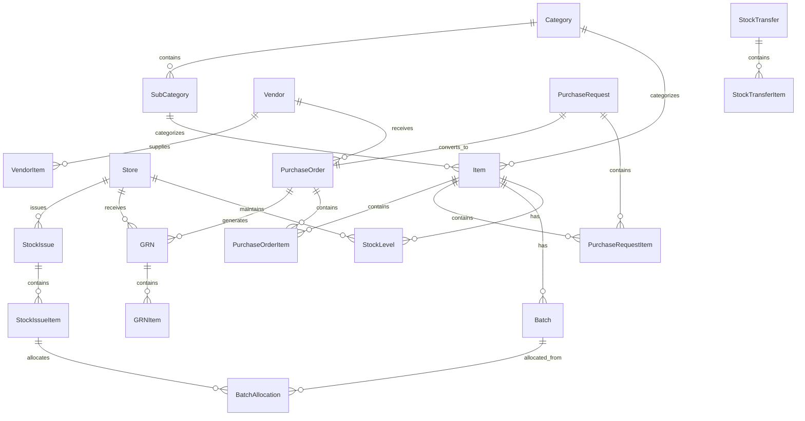

# Design Document: Inventory Management Module

## Overview

The Inventory Management Module is a comprehensive system for managing consumable and non-fixed inventory items within a school management system. The module provides end-to-end inventory lifecycle management from procurement through consumption, with robust integration to the Finance Module for cost tracking and budget control.

### Key Design Principles

1. **Separation of Concerns**: Clear boundaries between inventory operations, financial integration, and reporting
2. **Audit-First Design**: Every transaction is immutably logged for accountability
3. **Integration-Ready**: Well-defined interfaces for Finance, Asset, and Stock module integration
4. **Multi-Tenancy**: Support for multiple stores/warehouses with proper isolation
5. **Extensibility**: Modular design allowing future enhancements without core changes

### Technology Stack

- **Frontend**: React with functional components and hooks
- **Backend**: Node.js with Express.js
- **ORM**: Prisma for type-safe database access
- **Database**: PostgreSQL for relational data with ACID guarantees
- **Authentication**: JWT-based authentication (existing system)
- **File Storage**: Local filesystem for barcode/QR code images

## Architecture

### System Architecture

The Inventory Management Module follows a layered architecture:

```
┌─────────────────────────────────────────────────────────────┐
│                     Presentation Layer                       │
│  (React Components, Forms, Reports, Dashboards)             │
└─────────────────────────────────────────────────────────────┘
                            │
                            ▼
┌─────────────────────────────────────────────────────────────┐
│                      API Layer (REST)                        │
│  (Express Routes, Request Validation, Response Formatting)  │
└─────────────────────────────────────────────────────────────┘
                            │
                            ▼
┌─────────────────────────────────────────────────────────────┐
│                    Business Logic Layer                      │
│  (Services: Inventory, Procurement, Valuation, Alerts)      │
└─────────────────────────────────────────────────────────────┘
                            │
                            ▼
┌─────────────────────────────────────────────────────────────┐
│                    Data Access Layer                         │
│  (Prisma Repositories, Transaction Management)              │
└─────────────────────────────────────────────────────────────┘
                            │
                            ▼
┌─────────────────────────────────────────────────────────────┐
│                    PostgreSQL Database                       │
└─────────────────────────────────────────────────────────────┘

External Integrations:
┌──────────────────┐    ┌──────────────────┐
│  Finance Module  │◄───┤ Integration Layer│
└──────────────────┘    └──────────────────┘
```

### Module Boundaries

**Inventory Core**:
- Item master management
- Stock transactions (inward, outward, transfer)
- Batch and lot tracking
- Stock level monitoring

**Procurement**:
- Vendor management
- Purchase request workflow
- Purchase order management
- Goods receipt processing

**Valuation**:
- Cost calculation (FIFO/LIFO/Weighted Average)
- Stock valuation reporting
- Cost allocation to departments

**Integration**:
- Finance Module connector for cost posting
- Notification service for alerts
- Audit logging service

**Reporting**:
- Stock status reports
- Movement history
- Consumption analytics
- Vendor performance

## Components and Interfaces

### Core Components

#### 1. Item Master Service

**Responsibilities**:
- CRUD operations for inventory items
- Category and sub-category management
- Barcode/QR code generation and assignment
- Item validation and business rules

**Key Methods**:
```typescript
interface ItemMasterService {
  createItem(data: CreateItemDTO): Promise<Item>
  updateItem(id: string, data: UpdateItemDTO): Promise<Item>
  getItem(id: string): Promise<Item>
  listItems(filters: ItemFilters): Promise<PaginatedItems>
  deleteItem(id: string): Promise<void>
  generateBarcode(itemId: string): Promise<string>
  assignBarcode(itemId: string, barcode: string): Promise<void>
}
```

#### 2. Procurement Service

**Responsibilities**:
- Purchase request creation and management
- Purchase order generation and tracking
- Approval workflow orchestration
- Vendor management

**Key Methods**:
```typescript
interface ProcurementService {
  createPurchaseRequest(data: CreatePRDTO): Promise<PurchaseRequest>
  approvePurchaseRequest(prId: string, approverId: string): Promise<PurchaseRequest>
  convertToOrder(prId: string, vendorId: string): Promise<PurchaseOrder>
  createPurchaseOrder(data: CreatePODTO): Promise<PurchaseOrder>
  updateOrderStatus(poId: string, status: POStatus): Promise<PurchaseOrder>
  listPendingApprovals(userId: string): Promise<PurchaseRequest[]>
}
```

#### 3. Stock Transaction Service

**Responsibilities**:
- Stock inward processing (GRN)
- Stock outward processing (issues)
- Inter-store transfers
- Stock adjustments (damaged/lost)
- Transaction validation and execution

**Key Methods**:
```typescript
interface StockTransactionService {
  receiveGoods(data: CreateGRNDTO): Promise<GRN>
  issueStock(data: IssueStockDTO): Promise<StockIssue>
  transferStock(data: TransferStockDTO): Promise<StockTransfer>
  adjustStock(data: AdjustStockDTO): Promise<StockAdjustment>
  returnStock(data: ReturnStockDTO): Promise<StockReturn>
  validateStockAvailability(storeId: string, itemId: string, quantity: number): Promise<boolean>
}
```

#### 4. Inventory Valuation Service

**Responsibilities**:
- Calculate stock value using configured method
- Determine cost of goods issued
- Maintain cost layers for FIFO/LIFO
- Generate valuation reports

**Key Methods**:
```typescript
interface ValuationService {
  calculateStockValue(storeId: string, itemId: string): Promise<number>
  getIssueCost(itemId: string, quantity: number, method: ValuationMethod): Promise<number>
  updateCostLayers(itemId: string, quantity: number, unitCost: number): Promise<void>
  getValuationReport(storeId?: string): Promise<ValuationReport>
  recalculateValuation(method: ValuationMethod): Promise<void>
}
```

#### 5. Batch Tracking Service

**Responsibilities**:
- Batch creation and management
- Batch allocation during issues
- Batch movement tracking
- Expiry monitoring

**Key Methods**:
```typescript
interface BatchTrackingService {
  createBatch(data: CreateBatchDTO): Promise<Batch>
  allocateBatch(itemId: string, quantity: number, strategy: 'FIFO' | 'FEFO'): Promise<BatchAllocation[]>
  getBatchStock(batchId: string): Promise<number>
  getExpiringBatches(daysThreshold: number): Promise<Batch[]>
  trackBatchMovement(batchId: string, transactionId: string): Promise<void>
}
```

#### 6. Alert Service

**Responsibilities**:
- Monitor stock levels against reorder points
- Track expiring items
- Generate and dispatch alerts
- Alert acknowledgment tracking

**Key Methods**:
```typescript
interface AlertService {
  checkLowStock(): Promise<Alert[]>
  checkExpiringItems(): Promise<Alert[]>
  generateAlert(type: AlertType, data: AlertData): Promise<Alert>
  getActiveAlerts(userId: string): Promise<Alert[]>
  acknowledgeAlert(alertId: string, userId: string): Promise<void>
}
```

#### 7. Finance Integration Service

**Responsibilities**:
- Post inventory costs to Finance Module
- Verify budget availability
- Handle integration failures with retry logic
- Maintain reconciliation data

**Key Methods**:
```typescript
interface FinanceIntegrationService {
  postPurchaseCost(poId: string, amount: number, vendorId: string): Promise<FinanceTransaction>
  postConsumptionCost(issueId: string, departmentId: string, amount: number): Promise<FinanceTransaction>
  postAdjustmentCost(adjustmentId: string, amount: number): Promise<FinanceTransaction>
  verifyBudget(departmentId: string, amount: number): Promise<boolean>
  retryFailedTransactions(): Promise<void>
  getReconciliationReport(dateRange: DateRange): Promise<ReconciliationReport>
}
```

#### 8. Audit Service

**Responsibilities**:
- Log all inventory transactions
- Maintain immutable audit trail
- Provide audit query capabilities
- Flag critical transactions

**Key Methods**:
```typescript
interface AuditService {
  logTransaction(data: AuditLogDTO): Promise<AuditLog>
  getAuditTrail(filters: AuditFilters): Promise<PaginatedAuditLogs>
  getItemHistory(itemId: string): Promise<AuditLog[]>
  getUserActivity(userId: string, dateRange: DateRange): Promise<AuditLog[]>
  flagCriticalTransaction(transactionId: string, reason: string): Promise<void>
}
```

#### 9. Report Service

**Responsibilities**:
- Generate inventory reports
- Export reports to PDF/Excel
- Cache frequently accessed reports
- Provide report scheduling

**Key Methods**:
```typescript
interface ReportService {
  generateStockStatusReport(storeId?: string): Promise<StockStatusReport>
  generateMovementReport(dateRange: DateRange, filters: MovementFilters): Promise<MovementReport>
  generateConsumptionReport(departmentId?: string, dateRange?: DateRange): Promise<ConsumptionReport>
  generateVendorPerformanceReport(vendorId?: string): Promise<VendorPerformanceReport>
  exportReport(reportId: string, format: 'PDF' | 'EXCEL'): Promise<Buffer>
}
```

### API Endpoints

#### Item Master APIs

```
POST   /api/inventory/items                 - Create item
GET    /api/inventory/items                 - List items (with filters)
GET    /api/inventory/items/:id             - Get item details
PUT    /api/inventory/items/:id             - Update item
DELETE /api/inventory/items/:id             - Delete item
POST   /api/inventory/items/:id/barcode     - Generate/assign barcode
```

#### Procurement APIs

```
POST   /api/inventory/purchase-requests     - Create purchase request
GET    /api/inventory/purchase-requests     - List purchase requests
GET    /api/inventory/purchase-requests/:id - Get PR details
PUT    /api/inventory/purchase-requests/:id/approve - Approve PR
PUT    /api/inventory/purchase-requests/:id/reject  - Reject PR
POST   /api/inventory/purchase-requests/:id/convert - Convert PR to PO

POST   /api/inventory/purchase-orders       - Create purchase order
GET    /api/inventory/purchase-orders       - List purchase orders
GET    /api/inventory/purchase-orders/:id   - Get PO details
PUT    /api/inventory/purchase-orders/:id   - Update PO
```

#### Stock Transaction APIs

```
POST   /api/inventory/grn                   - Create goods receipt note
GET    /api/inventory/grn                   - List GRNs
GET    /api/inventory/grn/:id               - Get GRN details

POST   /api/inventory/issues                - Issue stock
GET    /api/inventory/issues                - List stock issues
GET    /api/inventory/issues/:id            - Get issue details

POST   /api/inventory/transfers             - Create transfer
GET    /api/inventory/transfers             - List transfers
PUT    /api/inventory/transfers/:id/receive - Receive transfer

POST   /api/inventory/adjustments           - Create adjustment
GET    /api/inventory/adjustments           - List adjustments

POST   /api/inventory/returns               - Create return
GET    /api/inventory/returns               - List returns
```

#### Stock Query APIs

```
GET    /api/inventory/stock                 - Get current stock levels
GET    /api/inventory/stock/:itemId         - Get item stock details
GET    /api/inventory/stock/:itemId/batches - Get batch-wise stock
```

#### Alert APIs

```
GET    /api/inventory/alerts                - Get active alerts
PUT    /api/inventory/alerts/:id/acknowledge - Acknowledge alert
```

#### Report APIs

```
GET    /api/inventory/reports/stock-status  - Stock status report
GET    /api/inventory/reports/movement      - Movement report
GET    /api/inventory/reports/consumption   - Consumption report
GET    /api/inventory/reports/vendor-performance - Vendor performance
GET    /api/inventory/reports/valuation     - Valuation report
GET    /api/inventory/reports/expiry        - Expiry report
POST   /api/inventory/reports/:id/export    - Export report
```

## Data Models

### Core Entities

#### Item

```prisma
model Item {
  id                String    @id @default(uuid())
  itemCode          String    @unique
  name              String
  description       String?
  categoryId        String
  category          Category  @relation(fields: [categoryId], references: [id])
  subCategoryId     String?
  subCategory       SubCategory? @relation(fields: [subCategoryId], references: [id])
  unitOfMeasure     String
  minimumStockLevel Int       @default(0)
  isPerishable      Boolean   @default(false)
  isBatchTracked    Boolean   @default(false)
  barcode           String?   @unique
  qrCode            String?   @unique
  isActive          Boolean   @default(true)
  createdBy         String
  createdAt         DateTime  @default(now())
  updatedAt         DateTime  @updatedAt
  
  stockLevels       StockLevel[]
  batches           Batch[]
  purchaseRequestItems PurchaseRequestItem[]
  purchaseOrderItems   PurchaseOrderItem[]
  
  @@index([categoryId])
  @@index([barcode])
}
```

#### Category and SubCategory

```prisma
model Category {
  id          String        @id @default(uuid())
  name        String        @unique
  description String?
  createdAt   DateTime      @default(now())
  
  items       Item[]
  subCategories SubCategory[]
}

model SubCategory {
  id          String    @id @default(uuid())
  name        String
  categoryId  String
  category    Category  @relation(fields: [categoryId], references: [id])
  description String?
  createdAt   DateTime  @default(now())
  
  items       Item[]
  
  @@unique([categoryId, name])
}
```

#### Store

```prisma
model Store {
  id          String    @id @default(uuid())
  storeCode   String    @unique
  name        String
  location    String?
  isActive    Boolean   @default(true)
  createdAt   DateTime  @default(now())
  updatedAt   DateTime  @updatedAt
  
  stockLevels StockLevel[]
  grns        GRN[]
  stockIssues StockIssue[]
  transfersFrom StockTransfer[] @relation("SourceStore")
  transfersTo   StockTransfer[] @relation("DestinationStore")
  userStores  UserStore[]
}
```

#### StockLevel

```prisma
model StockLevel {
  id          String    @id @default(uuid())
  storeId     String
  store       Store     @relation(fields: [storeId], references: [id])
  itemId      String
  item        Item      @relation(fields: [itemId], references: [id])
  quantity    Int       @default(0)
  updatedAt   DateTime  @updatedAt
  
  @@unique([storeId, itemId])
  @@index([itemId])
}
```

#### Batch

```prisma
model Batch {
  id                String    @id @default(uuid())
  batchNumber       String    @unique
  itemId            String
  item              Item      @relation(fields: [itemId], references: [id])
  storeId           String
  manufacturingDate DateTime?
  expiryDate        DateTime?
  quantity          Int
  remainingQuantity Int
  unitCost          Decimal   @db.Decimal(10, 2)
  createdAt         DateTime  @default(now())
  
  batchAllocations BatchAllocation[]
  
  @@index([itemId])
  @@index([expiryDate])
}
```

#### Vendor

```prisma
model Vendor {
  id            String    @id @default(uuid())
  vendorCode    String    @unique
  name          String
  contactPerson String?
  email         String?
  phone         String?
  address       String?
  paymentTerms  String?
  isActive      Boolean   @default(true)
  createdAt     DateTime  @default(now())
  updatedAt     DateTime  @updatedAt
  
  purchaseOrders PurchaseOrder[]
  vendorItems    VendorItem[]
}

model VendorItem {
  id        String   @id @default(uuid())
  vendorId  String
  vendor    Vendor   @relation(fields: [vendorId], references: [id])
  itemId    String
  unitPrice Decimal  @db.Decimal(10, 2)
  leadTime  Int?     // in days
  
  @@unique([vendorId, itemId])
}
```

#### Purchase Request

```prisma
model PurchaseRequest {
  id            String    @id @default(uuid())
  requestNumber String    @unique
  requestDate   DateTime  @default(now())
  requestedBy   String
  justification String?
  status        PRStatus  @default(DRAFT)
  approvedBy    String?
  approvedAt    DateTime?
  rejectedBy    String?
  rejectedAt    DateTime?
  rejectionReason String?
  createdAt     DateTime  @default(now())
  updatedAt     DateTime  @updatedAt
  
  items         PurchaseRequestItem[]
  purchaseOrder PurchaseOrder?
}

enum PRStatus {
  DRAFT
  SUBMITTED
  APPROVED
  REJECTED
  CONVERTED
}

model PurchaseRequestItem {
  id                String          @id @default(uuid())
  purchaseRequestId String
  purchaseRequest   PurchaseRequest @relation(fields: [purchaseRequestId], references: [id])
  itemId            String
  item              Item            @relation(fields: [itemId], references: [id])
  quantity          Int
  estimatedCost     Decimal?        @db.Decimal(10, 2)
  
  @@index([purchaseRequestId])
}
```

#### Purchase Order

```prisma
model PurchaseOrder {
  id                String    @id @default(uuid())
  orderNumber       String    @unique
  purchaseRequestId String?   @unique
  purchaseRequest   PurchaseRequest? @relation(fields: [purchaseRequestId], references: [id])
  vendorId          String
  vendor            Vendor    @relation(fields: [vendorId], references: [id])
  orderDate         DateTime  @default(now())
  expectedDelivery  DateTime?
  paymentTerms      String?
  status            POStatus  @default(CREATED)
  totalAmount       Decimal   @db.Decimal(10, 2)
  createdBy         String
  createdAt         DateTime  @default(now())
  updatedAt         DateTime  @updatedAt
  
  items             PurchaseOrderItem[]
  grns              GRN[]
}

enum POStatus {
  CREATED
  SENT
  PARTIALLY_RECEIVED
  FULLY_RECEIVED
  CANCELLED
}

model PurchaseOrderItem {
  id              String        @id @default(uuid())
  purchaseOrderId String
  purchaseOrder   PurchaseOrder @relation(fields: [purchaseOrderId], references: [id])
  itemId          String
  item            Item          @relation(fields: [itemId], references: [id])
  quantity        Int
  unitPrice       Decimal       @db.Decimal(10, 2)
  receivedQuantity Int          @default(0)
  
  @@index([purchaseOrderId])
}
```

#### Goods Receipt Note (GRN)

```prisma
model GRN {
  id              String        @id @default(uuid())
  grnNumber       String        @unique
  purchaseOrderId String
  purchaseOrder   PurchaseOrder @relation(fields: [purchaseOrderId], references: [id])
  storeId         String
  store           Store         @relation(fields: [storeId], references: [id])
  receiptDate     DateTime      @default(now())
  receivedBy      String
  remarks         String?
  createdAt       DateTime      @default(now())
  
  items           GRNItem[]
}

model GRNItem {
  id              String   @id @default(uuid())
  grnId           String
  grn             GRN      @relation(fields: [grnId], references: [id])
  itemId          String
  quantity        Int
  batchNumber     String?
  manufacturingDate DateTime?
  expiryDate      DateTime?
  unitCost        Decimal  @db.Decimal(10, 2)
  damagedQuantity Int      @default(0)
  
  @@index([grnId])
}
```

#### Stock Issue

```prisma
model StockIssue {
  id           String    @id @default(uuid())
  issueNumber  String    @unique
  storeId      String
  store        Store     @relation(fields: [storeId], references: [id])
  departmentId String
  issueDate    DateTime  @default(now())
  issuedBy     String
  receivedBy   String?
  remarks      String?
  createdAt    DateTime  @default(now())
  
  items        StockIssueItem[]
}

model StockIssueItem {
  id           String     @id @default(uuid())
  stockIssueId String
  stockIssue   StockIssue @relation(fields: [stockIssueId], references: [id])
  itemId       String
  quantity     Int
  unitCost     Decimal    @db.Decimal(10, 2)
  batchId      String?
  
  batchAllocations BatchAllocation[]
  
  @@index([stockIssueId])
}

model BatchAllocation {
  id               String         @id @default(uuid())
  stockIssueItemId String
  stockIssueItem   StockIssueItem @relation(fields: [stockIssueItemId], references: [id])
  batchId          String
  batch            Batch          @relation(fields: [batchId], references: [id])
  quantity         Int
  
  @@index([batchId])
}
```

#### Stock Transfer

```prisma
model StockTransfer {
  id                String         @id @default(uuid())
  transferNumber    String         @unique
  sourceStoreId     String
  sourceStore       Store          @relation("SourceStore", fields: [sourceStoreId], references: [id])
  destinationStoreId String
  destinationStore  Store          @relation("DestinationStore", fields: [destinationStoreId], references: [id])
  transferDate      DateTime       @default(now())
  receivedDate      DateTime?
  status            TransferStatus @default(INITIATED)
  initiatedBy       String
  receivedBy        String?
  remarks           String?
  createdAt         DateTime       @default(now())
  
  items             StockTransferItem[]
}

enum TransferStatus {
  INITIATED
  IN_TRANSIT
  RECEIVED
  CANCELLED
}

model StockTransferItem {
  id              String        @id @default(uuid())
  stockTransferId String
  stockTransfer   StockTransfer @relation(fields: [stockTransferId], references: [id])
  itemId          String
  quantity        Int
  batchId         String?
  
  @@index([stockTransferId])
}
```

#### Stock Adjustment

```prisma
model StockAdjustment {
  id             String         @id @default(uuid())
  adjustmentNumber String       @unique
  storeId        String
  itemId         String
  adjustmentType AdjustmentType
  quantity       Int
  reason         String
  approvedBy     String?
  adjustedBy     String
  adjustmentDate DateTime       @default(now())
  unitCost       Decimal        @db.Decimal(10, 2)
  createdAt      DateTime       @default(now())
}

enum AdjustmentType {
  DAMAGED
  LOST
  EXPIRED
  FOUND
  CORRECTION
}
```

#### Alert

```prisma
model Alert {
  id              String    @id @default(uuid())
  alertType       AlertType
  itemId          String?
  storeId         String?
  message         String
  severity        AlertSeverity
  isAcknowledged  Boolean   @default(false)
  acknowledgedBy  String?
  acknowledgedAt  DateTime?
  createdAt       DateTime  @default(now())
  
  @@index([isAcknowledged])
  @@index([createdAt])
}

enum AlertType {
  LOW_STOCK
  EXPIRING_SOON
  EXPIRED
  CRITICAL_ADJUSTMENT
}

enum AlertSeverity {
  INFO
  WARNING
  CRITICAL
}
```

#### Audit Log

```prisma
model AuditLog {
  id              String    @id @default(uuid())
  userId          String
  transactionType String
  entityType      String
  entityId        String
  action          String
  oldValue        Json?
  newValue        Json?
  ipAddress       String?
  userAgent       String?
  isCritical      Boolean   @default(false)
  timestamp       DateTime  @default(now())
  
  @@index([userId])
  @@index([entityType, entityId])
  @@index([timestamp])
}
```

#### Cost Layer (for FIFO/LIFO)

```prisma
model CostLayer {
  id               String   @id @default(uuid())
  itemId           String
  storeId          String
  quantity         Int
  remainingQuantity Int
  unitCost         Decimal  @db.Decimal(10, 2)
  receiptDate      DateTime
  grnId            String?
  createdAt        DateTime @default(now())
  
  @@index([itemId, storeId])
  @@index([receiptDate])
}
```

#### Finance Transaction Queue

```prisma
model FinanceTransactionQueue {
  id              String    @id @default(uuid())
  transactionType String
  referenceId     String
  amount          Decimal   @db.Decimal(10, 2)
  departmentId    String?
  vendorId        String?
  status          QueueStatus @default(PENDING)
  retryCount      Int       @default(0)
  lastError       String?
  createdAt       DateTime  @default(now())
  processedAt     DateTime?
  
  @@index([status])
}

enum QueueStatus {
  PENDING
  PROCESSING
  COMPLETED
  FAILED
}
```

### Database Relationships




## Correctness Properties

A property is a characteristic or behavior that should hold true across all valid executions of a system—essentially, a formal statement about what the system should do. Properties serve as the bridge between human-readable specifications and machine-verifiable correctness guarantees.

### Property Reflection

After analyzing all acceptance criteria, I identified several areas where properties can be consolidated:

1. **Audit Trail Properties**: Requirements 1.6, 2.5, 7.8, 9.5, and 14.1 all relate to audit logging. These can be consolidated into comprehensive audit properties.

2. **Uniqueness Properties**: Requirements 1.4, 3.4, 4.4, and 12.1 all test uniqueness of generated identifiers. These follow the same pattern.

3. **Stock Level Invariants**: Requirements 5.5, 6.4, 7.4, 7.5, and 9.3 all test that stock levels change correctly. These can be consolidated into stock invariant properties.

4. **Validation Properties**: Requirements 1.1, 2.1, 3.1, 4.3, 6.1, 7.1, 9.1, and 18.5 all test required field validation. These follow similar patterns.

5. **Finance Integration**: Requirements 5.6, 6.8, 9.4, 15.1, 15.2, and 15.3 all test finance posting. These can be consolidated.

6. **Batch Tracking**: Requirements 6.5 and 11.6 are identical (FIFO batch allocation).

7. **Role-Based Access**: Requirements 13.1, 13.2, and 13.3 define roles but can be tested together as a permission matrix.

### Core Properties

#### Property 1: Item Creation Validation
*For any* item creation request, if required fields (name, category, sub-category, unit of measure) are missing, then the system should reject the creation and return a validation error.

**Validates: Requirements 1.1**

#### Property 2: Unique Identifier Generation
*For any* set of entities (items, purchase requests, purchase orders, GRNs, stores), all generated identifiers should be unique across the system.

**Validates: Requirements 1.4, 3.4, 4.4, 12.1**

#### Property 3: Item Deletion Protection
*For any* item with existing stock levels greater than zero or transaction history, attempting to delete that item should fail and preserve the item.

**Validates: Requirements 1.7**

#### Property 4: Perishable Item Expiry Tracking
*For any* item marked as perishable, the system should allow and track expiry dates, while non-perishable items should not require expiry dates.

**Validates: Requirements 1.3, 5.4**

#### Property 5: Barcode Assignment Round Trip
*For any* item, assigning a barcode or QR code and then retrieving the item should return the same barcode/QR code value.

**Validates: Requirements 1.5**

#### Property 6: Inactive Vendor Purchase Prevention
*For any* vendor marked as inactive, attempting to create a purchase order for that vendor should fail with an appropriate error.

**Validates: Requirements 2.3**

#### Property 7: Automatic Reorder Alert Generation
*For any* item in a store, when stock level falls below the configured minimum stock level, the system should automatically generate a low stock alert.

**Validates: Requirements 3.2, 8.1**

#### Property 8: Purchase Request Multi-Item Support
*For any* purchase request containing multiple items, all items should be persisted and retrievable when querying the purchase request.

**Validates: Requirements 3.3**

#### Property 9: Purchase Request Status Tracking
*For any* purchase request, status transitions (Draft → Submitted → Approved/Rejected → Converted) should be tracked and queryable.

**Validates: Requirements 3.5, 4.7**

#### Property 10: Budget Verification Before Purchase Order
*For any* purchase order creation request, if the Finance Module indicates insufficient budget, then the purchase order creation should fail with a budget error.

**Validates: Requirements 4.5, 4.6, 15.6**

#### Property 11: Purchase Order Version History
*For any* purchase order that is modified, the system should maintain a version history showing all changes with timestamps.

**Validates: Requirements 4.8**

#### Property 12: GRN Stock Level Increase Invariant
*For any* goods receipt note (GRN), the stock level after processing should equal the stock level before plus the received quantity (minus any damaged quantity).

**Validates: Requirements 5.5**

#### Property 13: Partial Receipt Support
*For any* purchase order, creating a GRN with quantity less than ordered quantity should be allowed, and the purchase order should reflect partial receipt status.

**Validates: Requirements 5.2, 5.8**

#### Property 14: Batch Tracking Requirement Enforcement
*For any* item configured for batch tracking, receiving goods without providing batch number and manufacturing date should fail validation.

**Validates: Requirements 5.3, 11.1**

#### Property 15: Stock Issue Availability Check
*For any* stock issue request, if the requested quantity exceeds available stock in the store, then the issue should fail with an insufficient stock error.

**Validates: Requirements 6.2, 6.3**

#### Property 16: Stock Issue Decrease Invariant
*For any* stock issue, the stock level after processing should equal the stock level before minus the issued quantity.

**Validates: Requirements 6.4**

#### Property 17: Batch FIFO Allocation
*For any* stock issue of a batch-tracked item, the system should allocate stock from the oldest batch first (FIFO strategy), and the batch allocation should be recorded.

**Validates: Requirements 6.5, 11.2, 11.6**

#### Property 18: Stock Return Increase Invariant
*For any* stock return from a department, the stock level after processing should equal the stock level before plus the returned quantity.

**Validates: Requirements 6.7**

#### Property 19: Inter-Store Transfer Stock Conservation
*For any* completed inter-store transfer, the sum of stock levels across both stores should remain constant (source decrease + destination increase = 0 net change).

**Validates: Requirements 7.4, 7.5**

#### Property 20: Transfer Batch Preservation
*For any* inter-store transfer of batch-tracked items, the batch information (batch number, manufacturing date, expiry date) should be preserved in the destination store.

**Validates: Requirements 7.7**

#### Property 21: Expiry Alert Generation
*For any* batch with an expiry date within 30 days, the system should generate an expiry alert.

**Validates: Requirements 8.2**

#### Property 22: Expired Item Issue Prevention
*For any* item with expired batches, attempting to issue stock from expired batches should fail with an expiry error.

**Validates: Requirements 8.3**

#### Property 23: Alert Acknowledgment State Change
*For any* alert, acknowledging the alert should update its status to acknowledged and record the acknowledging user and timestamp.

**Validates: Requirements 8.6**

#### Property 24: Stock Adjustment Decrease Invariant
*For any* stock adjustment (damaged, lost, expired), the stock level after processing should equal the stock level before minus the adjustment quantity.

**Validates: Requirements 9.3**

#### Property 25: Significant Adjustment Approval Requirement
*For any* stock adjustment exceeding a configured threshold, the adjustment should require approval from a School Administrator role.

**Validates: Requirements 9.6**

#### Property 26: FIFO Valuation Correctness
*For any* stock issue using FIFO valuation, the cost should be calculated from the oldest cost layers first, and cost layers should be consumed in chronological order.

**Validates: Requirements 10.1, 10.5**

#### Property 27: LIFO Valuation Correctness
*For any* stock issue using LIFO valuation, the cost should be calculated from the newest cost layers first, and cost layers should be consumed in reverse chronological order.

**Validates: Requirements 10.2, 10.5**

#### Property 28: Weighted Average Valuation Correctness
*For any* stock issue using Weighted Average valuation, the cost should be calculated as the total value divided by total quantity across all cost layers.

**Validates: Requirements 10.3, 10.5**

#### Property 29: Valuation Method Consistency
*For any* sequence of stock valuations within the same time period, all valuations should use the same configured valuation method.

**Validates: Requirements 10.4**

#### Property 30: Batch Movement History Completeness
*For any* batch, the system should maintain a complete history of all movements (receipt, issue, transfer) with timestamps and transaction references.

**Validates: Requirements 11.3**

#### Property 31: Batch Stock Query Breakdown
*For any* item configured for batch tracking, querying stock levels should return a breakdown showing quantity per batch.

**Validates: Requirements 11.4**

#### Property 32: Batch Recall Traceability
*For any* batch, the system should be able to identify all departments and locations that received items from that batch.

**Validates: Requirements 11.5**

#### Property 33: Store-Specific Stock Isolation
*For any* user assigned to specific stores, all stock queries and transactions should be restricted to those assigned stores only.

**Validates: Requirements 12.2, 12.4**

#### Property 34: Multi-Store Access Permission
*For any* user assigned to multiple stores, the user should be able to view and transact in all assigned stores.

**Validates: Requirements 12.5**

#### Property 35: Role-Based Permission Enforcement
*For any* user with a specific role (Store Manager, Finance Officer, School Administrator), attempting to perform actions outside their role permissions should be denied and logged.

**Validates: Requirements 13.1, 13.2, 13.3, 13.4, 13.5**

#### Property 36: Role Assignment Authorization
*For any* role assignment or modification request, only users with School Administrator role should be able to perform the operation.

**Validates: Requirements 13.6**

#### Property 37: Comprehensive Transaction Audit Logging
*For any* inventory transaction (GRN, issue, transfer, adjustment), the system should create an immutable audit log entry containing user, timestamp, transaction type, and affected items.

**Validates: Requirements 1.6, 2.5, 7.8, 9.5, 14.1**

#### Property 38: Audit Log Immutability
*For any* audit log entry, attempting to modify or delete the entry should fail and preserve the original entry.

**Validates: Requirements 14.2**

#### Property 39: Audit Trail Query Filtering
*For any* audit trail query with filters (date range, user, item, transaction type), the results should contain only entries matching all specified filters.

**Validates: Requirements 14.3**

#### Property 40: Item Transaction History Completeness
*For any* item, querying its transaction history should return all transactions that affected that item in chronological order.

**Validates: Requirements 14.4**

#### Property 41: Critical Transaction Flagging
*For any* transaction meeting critical criteria (large adjustments, deletions, high-value purchases), the system should automatically flag the transaction for review.

**Validates: Requirements 14.5**

#### Property 42: Finance Integration Posting
*For any* inventory transaction with financial impact (GRN, stock issue, adjustment), the system should post the cost to the Finance Module with correct transaction type and amount.

**Validates: Requirements 5.6, 6.8, 9.4, 15.1, 15.2, 15.3**

#### Property 43: Finance Integration Failure Resilience
*For any* finance posting that fails, the system should queue the transaction for retry and maintain the queue until successful posting.

**Validates: Requirements 15.4**

#### Property 44: Stock Status Report Completeness
*For any* stock status report request, the report should include all active items with their current quantities by store.

**Validates: Requirements 16.1**

#### Property 45: Movement Report Date Range Filtering
*For any* stock movement report with a date range, the report should include all transactions that occurred within that date range.

**Validates: Requirements 16.2**

#### Property 46: Consumption Report Department Aggregation
*For any* consumption report, the report should aggregate stock issues by department and show total consumption per department.

**Validates: Requirements 16.3**

#### Property 47: Low Stock Report Accuracy
*For any* low stock alert report, the report should include all items where current stock level is below the configured minimum stock level.

**Validates: Requirements 16.4**

#### Property 48: Vendor Performance Metric Calculation
*For any* vendor performance report, the report should calculate average delivery time and quality metrics based on completed purchase orders.

**Validates: Requirements 16.5**

#### Property 49: Stock Valuation Report Calculation
*For any* stock valuation report, the total inventory value should equal the sum of (quantity × unit cost) for all items using the configured valuation method.

**Validates: Requirements 16.6**

#### Property 50: Expiry Report Date Range Filtering
*For any* expiry report with a timeframe, the report should include all batches with expiry dates within that timeframe.

**Validates: Requirements 16.7**

#### Property 51: Report Filter Support
*For any* report generation request with filters (date range, store, category, department), the report should include only data matching all specified filters.

**Validates: Requirements 16.9**

#### Property 52: Barcode Lookup Accuracy
*For any* barcode or QR code assigned to an item, scanning that code should return the correct item details.

**Validates: Requirements 17.1, 17.2**

#### Property 53: Invalid Code Error Handling
*For any* barcode or QR code that is not assigned to any item, scanning should return an appropriate error indicating the code was not found.

**Validates: Requirements 17.4**

#### Property 54: Standard Barcode Format Support
*For any* barcode in standard formats (EAN-13, UPC, Code 128), the system should correctly parse and recognize the barcode.

**Validates: Requirements 17.5**

#### Property 55: Batch Scanning Processing
*For any* sequence of barcode scans during goods receipt, all scanned items should be processed and added to the GRN.

**Validates: Requirements 17.7**

#### Property 56: Positive Quantity Validation
*For any* transaction involving quantities (issue, transfer, adjustment), negative or zero quantities should be rejected with a validation error.

**Validates: Requirements 18.1**

#### Property 57: Future Expiry Date Validation
*For any* expiry date entry, dates in the past should be rejected with a validation error.

**Validates: Requirements 18.2**

#### Property 58: Active Item Validation
*For any* transaction involving item selection, inactive or discontinued items should be rejected with a validation error.

**Validates: Requirements 18.3**

#### Property 59: Required Field Validation
*For any* form submission with required fields, missing required fields should prevent submission and return validation errors.

**Validates: Requirements 18.5**

#### Property 60: Non-Negative Stock Invariant
*For any* inventory transaction, the resulting stock level should never be negative; operations that would result in negative stock should be prevented.

**Validates: Requirements 18.6**

#### Property 61: Transaction Atomicity
*For any* transaction that fails during processing, all partial changes should be rolled back and the system should return to its pre-transaction state.

**Validates: Requirements 18.7**

## Error Handling

### Error Categories

1. **Validation Errors**: Input validation failures (missing fields, invalid formats, business rule violations)
2. **Authorization Errors**: Permission denied, role-based access violations
3. **Business Logic Errors**: Insufficient stock, budget exceeded, inactive entities
4. **Integration Errors**: Finance Module communication failures, external service timeouts
5. **System Errors**: Database failures, unexpected exceptions

### Error Response Format

All API errors should follow a consistent format:

```typescript
interface ErrorResponse {
  success: false
  error: {
    code: string          // Machine-readable error code
    message: string       // Human-readable error message
    details?: any         // Additional error context
    field?: string        // Field name for validation errors
    timestamp: string     // ISO 8601 timestamp
  }
}
```

### Error Handling Strategies

**Validation Errors**:
- Return 400 Bad Request with detailed field-level errors
- Validate all inputs before processing
- Provide clear, actionable error messages

**Authorization Errors**:
- Return 403 Forbidden for permission violations
- Log all authorization failures for security audit
- Never expose sensitive information in error messages

**Business Logic Errors**:
- Return 422 Unprocessable Entity for business rule violations
- Provide context about why the operation failed
- Suggest corrective actions when possible

**Integration Errors**:
- Implement retry logic with exponential backoff
- Queue failed transactions for later processing
- Notify administrators of persistent failures
- Maintain system availability despite integration failures

**System Errors**:
- Return 500 Internal Server Error for unexpected failures
- Log full error details for debugging
- Rollback database transactions to maintain consistency
- Provide generic error messages to users (don't expose internals)

### Transaction Management

All multi-step operations should use database transactions:

```typescript
async function processStockIssue(data: IssueStockDTO): Promise<StockIssue> {
  return await prisma.$transaction(async (tx) => {
    // 1. Validate stock availability
    const stock = await tx.stockLevel.findUnique(...)
    if (stock.quantity < data.quantity) {
      throw new InsufficientStockError()
    }
    
    // 2. Create stock issue record
    const issue = await tx.stockIssue.create(...)
    
    // 3. Update stock levels
    await tx.stockLevel.update(...)
    
    // 4. Create audit log
    await tx.auditLog.create(...)
    
    // 5. Queue finance posting
    await tx.financeTransactionQueue.create(...)
    
    return issue
  })
}
```

If any step fails, the entire transaction is rolled back automatically.

## Testing Strategy

### Dual Testing Approach

The Inventory Management Module requires both unit testing and property-based testing for comprehensive coverage:

**Unit Tests**: Verify specific examples, edge cases, and error conditions
- Specific scenarios with known inputs and outputs
- Edge cases (empty lists, boundary values, special characters)
- Error conditions (invalid inputs, authorization failures)
- Integration points between components
- Mock external dependencies (Finance Module)

**Property Tests**: Verify universal properties across all inputs
- Generate random valid inputs (items, transactions, users)
- Verify invariants hold for all generated inputs
- Test properties defined in the Correctness Properties section
- Minimum 100 iterations per property test
- Use property-based testing library (fast-check for TypeScript)

Together, unit tests catch concrete bugs while property tests verify general correctness.

### Property-Based Testing Configuration

**Library Selection**: fast-check (TypeScript/JavaScript)

**Test Configuration**:
```typescript
import fc from 'fast-check'

describe('Inventory Management Properties', () => {
  it('Property 12: GRN Stock Level Increase Invariant', () => {
    // Feature: inventory-management-module, Property 12
    fc.assert(
      fc.property(
        fc.record({
          itemId: fc.uuid(),
          storeId: fc.uuid(),
          initialStock: fc.integer({ min: 0, max: 1000 }),
          receivedQuantity: fc.integer({ min: 1, max: 100 }),
          damagedQuantity: fc.integer({ min: 0, max: 10 })
        }),
        async (data) => {
          // Setup: Create item and store with initial stock
          const initialStock = await setupStock(data.itemId, data.storeId, data.initialStock)
          
          // Action: Process GRN
          await processGRN({
            itemId: data.itemId,
            storeId: data.storeId,
            quantity: data.receivedQuantity,
            damagedQuantity: data.damagedQuantity
          })
          
          // Assertion: Verify stock increased correctly
          const finalStock = await getStock(data.itemId, data.storeId)
          const expectedStock = data.initialStock + data.receivedQuantity - data.damagedQuantity
          expect(finalStock).toBe(expectedStock)
        }
      ),
      { numRuns: 100 }
    )
  })
})
```

**Property Test Requirements**:
- Each correctness property MUST be implemented by a SINGLE property-based test
- Each test MUST run minimum 100 iterations
- Each test MUST be tagged with a comment referencing the design property
- Tag format: `// Feature: inventory-management-module, Property {number}`
- Tests MUST use appropriate generators for domain objects
- Tests MUST clean up test data after execution

### Test Organization

```
backend/
  tests/
    unit/
      services/
        item-master.test.ts
        procurement.test.ts
        stock-transaction.test.ts
        valuation.test.ts
        batch-tracking.test.ts
        alert.test.ts
        finance-integration.test.ts
        audit.test.ts
        report.test.ts
      repositories/
        item.repository.test.ts
        stock.repository.test.ts
        transaction.repository.test.ts
    property/
      inventory-properties.test.ts
      procurement-properties.test.ts
      valuation-properties.test.ts
      integration-properties.test.ts
    integration/
      api/
        item-master.api.test.ts
        procurement.api.test.ts
        stock-transaction.api.test.ts
      finance-integration.test.ts
    generators/
      item.generator.ts
      transaction.generator.ts
      user.generator.ts
```

### Test Data Generators

Property tests require generators for domain objects:

```typescript
// generators/item.generator.ts
export const itemGenerator = fc.record({
  name: fc.string({ minLength: 1, maxLength: 100 }),
  categoryId: fc.uuid(),
  subCategoryId: fc.option(fc.uuid()),
  unitOfMeasure: fc.constantFrom('PCS', 'KG', 'LITER', 'BOX'),
  minimumStockLevel: fc.integer({ min: 0, max: 100 }),
  isPerishable: fc.boolean(),
  isBatchTracked: fc.boolean()
})

// generators/transaction.generator.ts
export const stockIssueGenerator = fc.record({
  storeId: fc.uuid(),
  departmentId: fc.uuid(),
  itemId: fc.uuid(),
  quantity: fc.integer({ min: 1, max: 100 }),
  issuedBy: fc.uuid(),
  receivedBy: fc.option(fc.uuid())
})
```

### Integration Testing

Integration tests verify:
- API endpoint functionality
- Database operations
- Finance Module integration
- Authentication and authorization
- Report generation and export

### Test Coverage Goals

- Unit test coverage: Minimum 80% code coverage
- Property test coverage: All 61 correctness properties implemented
- Integration test coverage: All API endpoints tested
- Error path coverage: All error conditions tested

### Continuous Integration

- Run unit tests on every commit
- Run property tests on every pull request
- Run integration tests before deployment
- Generate coverage reports
- Fail builds on test failures or coverage drops
