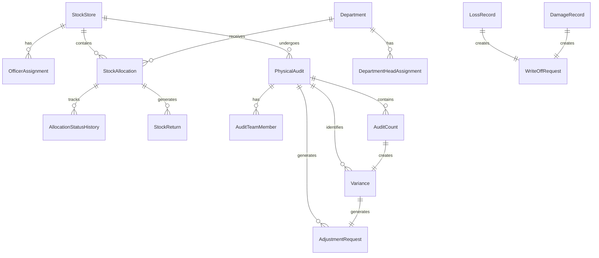

# Design Document: Stock Management Module

## Overview

The Stock Management Module is an operational layer that sits on top of the Inventory Management Module, providing day-to-day stock operation capabilities for school management. While the Inventory Module handles procurement, stock levels, and valuation, the Stock Management Module focuses on operational activities: department allocations, physical audits, lifecycle tracking, and consumption monitoring.

### Key Design Principles

1. **Layered Architecture**: Clear separation between stock operations and underlying inventory management
2. **Integration-First**: Seamless integration with Inventory, Finance, and Asset modules
3. **Audit-Centric**: Every operation is tracked for accountability and compliance
4. **Workflow-Driven**: Approval workflows for critical operations (write-offs, audit adjustments)
5. **Real-Time Visibility**: Dashboards and reports for operational decision-making

### Technology Stack

- **Frontend**: React with functional components and hooks (existing codebase)
- **Backend**: Node.js with Express.js
- **ORM**: Prisma for type-safe database access
- **Database**: PostgreSQL for relational data with ACID guarantees
- **Authentication**: JWT-based authentication (existing system)
- **File Storage**: Local filesystem for evidence attachments (photos, documents)

## Architecture

### System Architecture

The Stock Management Module follows a layered architecture with clear boundaries:

```
┌─────────────────────────────────────────────────────────────┐
│                     Presentation Layer                       │
│  (React Components, Dashboards, Forms, Reports)             │
└─────────────────────────────────────────────────────────────┘
                            │
                            ▼
┌─────────────────────────────────────────────────────────────┐
│                      API Layer (REST)                        │
│  (Express Routes, Request Validation, Response Formatting)  │
└─────────────────────────────────────────────────────────────┘
                            │
                            ▼
┌─────────────────────────────────────────────────────────────┐
│                    Business Logic Layer                      │
│  (Services: Allocation, Audit, Lifecycle, Reporting)        │
└─────────────────────────────────────────────────────────────┘
                            │
                            ▼
┌─────────────────────────────────────────────────────────────┐
│                    Data Access Layer                         │
│  (Prisma Repositories, Transaction Management)              │
└─────────────────────────────────────────────────────────────┘
                            │
                            ▼
┌─────────────────────────────────────────────────────────────┐
│                    PostgreSQL Database                       │
└─────────────────────────────────────────────────────────────┘

External Integrations:
┌──────────────────┐    ┌──────────────────┐    ┌──────────────────┐
│ Inventory Module │◄───┤ Integration Layer├───►│  Finance Module  │
└──────────────────┘    └──────────────────┘    └──────────────────┘
                                │
                                ▼
                        ┌──────────────────┐
                        │   Asset Module   │
                        └──────────────────┘
```

### Module Boundaries

**Stock Operations Core**:
- Store and department management
- Stock allocation and lifecycle tracking
- Stock returns processing
- Loss and damage reporting
- Write-off workflow

**Audit Management**:
- Physical audit initiation and planning
- Physical count recording
- Variance analysis and reporting
- Audit adjustment approval workflow
- Audit history and compliance tracking

**Consumption Tracking**:
- Department-wise consumption monitoring
- Budget control and alerts
- Consumption forecasting
- Usage pattern analysis

**Integration Layer**:
- Inventory Module connector for stock operations
- Finance Module connector for cost posting
- Asset Module connector for asset classification
- Notification service for alerts

**Reporting**:
- Stock allocation reports
- Consumption analysis
- Audit reports
- Loss and damage reports
- Accountability reports

## Components and Interfaces

### Core Components

#### 1. Store Management Service

**Responsibilities**:
- CRUD operations for stores/warehouses
- Responsible officer assignment and tracking
- Store capacity monitoring
- Store-wise stock visibility

**Key Methods**:
```typescript
interface StoreManagementService {
  createStore(data: CreateStoreDTO): Promise<StockStore>
  updateStore(id: string, data: UpdateStoreDTO): Promise<StockStore>
  getStore(id: string): Promise<StockStore>
  listStores(filters: StoreFilters): Promise<PaginatedStores>
  assignResponsibleOfficer(storeId: string, officerId: string): Promise<OfficerAssignment>
  getStoreStock(storeId: string): Promise<StoreStockSummary>
  deactivateStore(id: string): Promise<void>
}
```

#### 2. Department Management Service

**Responsibilities**:
- Department registration and management
- Department head assignment
- Budget allocation tracking
- Department stock visibility

**Key Methods**:
```typescript
interface DepartmentManagementService {
  createDepartment(data: CreateDepartmentDTO): Promise<Department>
  updateDepartment(id: string, data: UpdateDepartmentDTO): Promise<Department>
  getDepartment(id: string): Promise<Department>
  listDepartments(filters: DepartmentFilters): Promise<PaginatedDepartments>
  assignDepartmentHead(deptId: string, headId: string): Promise<void>
  setDepartmentBudget(deptId: string, budget: number): Promise<void>
  getDepartmentStock(deptId: string): Promise<DepartmentStockSummary>
}
```

#### 3. Stock Allocation Service

**Responsibilities**:
- Stock allocation to departments
- Allocation validation and authorization
- Budget verification
- Integration with Inventory and Finance modules

**Key Methods**:
```typescript
interface StockAllocationService {
  allocateStock(data: AllocateStockDTO): Promise<StockAllocation>
  validateAllocation(data: AllocateStockDTO): Promise<ValidationResult>
  checkBudgetAvailability(deptId: string, cost: number): Promise<boolean>
  getAllocations(filters: AllocationFilters): Promise<PaginatedAllocations>
  getAllocationDetails(id: string): Promise<StockAllocation>
  cancelAllocation(id: string, reason: string): Promise<void>
}
```

#### 4. Stock Lifecycle Service

**Responsibilities**:
- Track stock status transitions
- Update allocation status
- Calculate duration metrics
- Maintain status history

**Key Methods**:
```typescript
interface StockLifecycleService {
  updateStatus(allocationId: string, newStatus: StockStatus): Promise<StockAllocation>
  confirmReceipt(allocationId: string, receivedBy: string): Promise<void>
  markAsConsumed(allocationId: string): Promise<void>
  getStatusHistory(allocationId: string): Promise<StatusHistory[]>
  calculateDuration(allocationId: string): Promise<number>
  getOverdueAllocations(): Promise<StockAllocation[]>
}
```

#### 5. Stock Return Service

**Responsibilities**:
- Process stock returns from departments
- Condition assessment
- Partial return handling
- Integration with Inventory Module

**Key Methods**:
```typescript
interface StockReturnService {
  processReturn(data: ProcessReturnDTO): Promise<StockReturn>
  validateReturn(allocationId: string, quantity: number): Promise<ValidationResult>
  assessCondition(returnId: string, condition: ReturnCondition): Promise<void>
  getReturns(filters: ReturnFilters): Promise<PaginatedReturns>
  getReturnDetails(id: string): Promise<StockReturn>
}
```

#### 6. Loss and Damage Service

**Responsibilities**:
- Record stock losses and damages
- Evidence management (photo uploads)
- Incident report generation
- Route to write-off workflow

**Key Methods**:
```typescript
interface LossAndDamageService {
  recordLoss(data: RecordLossDTO): Promise<LossRecord>
  recordDamage(data: RecordDamageDTO): Promise<DamageRecord>
  uploadEvidence(recordId: string, files: File[]): Promise<void>
  generateIncidentReport(recordId: string): Promise<IncidentReport>
  getLossAndDamageRecords(filters: LDFilters): Promise<PaginatedRecords>
  getRecordDetails(id: string): Promise<LossOrDamageRecord>
}
```

#### 7. Write-Off Service

**Responsibilities**:
- Create write-off requests
- Approval workflow orchestration
- Integration with Inventory and Finance modules
- Write-off tracking and reporting

**Key Methods**:
```typescript
interface WriteOffService {
  createWriteOffRequest(data: CreateWriteOffDTO): Promise<WriteOffRequest>
  approveWriteOff(requestId: string, approverId: string): Promise<WriteOffRequest>
  rejectWriteOff(requestId: string, approverId: string, reason: string): Promise<WriteOffRequest>
  getPendingApprovals(userId: string): Promise<WriteOffRequest[]>
  getWriteOffHistory(filters: WriteOffFilters): Promise<PaginatedWriteOffs>
}
```

#### 8. Physical Audit Service

**Responsibilities**:
- Audit initiation and planning
- Audit checklist generation
- Audit team assignment
- Transaction freezing during audits

**Key Methods**:
```typescript
interface PhysicalAuditService {
  initiateAudit(data: InitiateAuditDTO): Promise<PhysicalAudit>
  generateChecklist(auditId: string): Promise<AuditChecklist>
  assignAuditTeam(auditId: string, teamMembers: string[]): Promise<void>
  freezeTransactions(auditId: string): Promise<void>
  unfreezeTransactions(auditId: string): Promise<void>
  getAudits(filters: AuditFilters): Promise<PaginatedAudits>
  getAuditDetails(id: string): Promise<PhysicalAudit>
}
```

#### 9. Physical Count Service

**Responsibilities**:
- Record physical counts
- Variance calculation
- Multi-auditor verification
- Count notes and observations

**Key Methods**:
```typescript
interface PhysicalCountService {
  recordCount(data: RecordCountDTO): Promise<AuditCount>
  calculateVariance(countId: string): Promise<Variance>
  requireVerification(countId: string): Promise<boolean>
  verifyCount(countId: string, verifierId: string): Promise<void>
  addCountNotes(countId: string, notes: string): Promise<void>
  getCounts(auditId: string): Promise<AuditCount[]>
}
```

#### 10. Variance Analysis Service

**Responsibilities**:
- Generate variance reports
- Categorize variances (overage/shortage)
- Calculate variance values
- Flag significant variances

**Key Methods**:
```typescript
interface VarianceAnalysisService {
  generateVarianceReport(auditId: string): Promise<VarianceReport>
  categorizeVariances(auditId: string): Promise<CategorizedVariances>
  calculateVarianceValue(variance: Variance): Promise<number>
  flagSignificantVariances(auditId: string, threshold: number): Promise<Variance[]>
  assignVarianceReason(varianceId: string, reason: VarianceReason): Promise<void>
  getVarianceAnalysis(auditId: string): Promise<VarianceAnalysis>
}
```

#### 11. Audit Adjustment Service

**Responsibilities**:
- Create adjustment requests from variances
- Approval workflow orchestration
- Integration with Inventory and Finance modules
- Adjustment tracking

**Key Methods**:
```typescript
interface AuditAdjustmentService {
  createAdjustmentRequests(auditId: string): Promise<AdjustmentRequest[]>
  approveAdjustment(requestId: string, approverId: string): Promise<AdjustmentRequest>
  rejectAdjustment(requestId: string, approverId: string, reason: string): Promise<AdjustmentRequest>
  bulkApprove(requestIds: string[], approverId: string): Promise<void>
  getPendingAdjustments(userId: string): Promise<AdjustmentRequest[]>
  getAdjustmentHistory(filters: AdjustmentFilters): Promise<PaginatedAdjustments>
}
```

#### 12. Consumption Tracking Service

**Responsibilities**:
- Track department consumption
- Calculate consumption rates
- Consumption forecasting
- Budget comparison

**Key Methods**:
```typescript
interface ConsumptionTrackingService {
  trackConsumption(allocationId: string): Promise<void>
  calculateConsumptionRate(deptId: string, itemId: string): Promise<number>
  forecastConsumption(deptId: string, itemId: string, period: number): Promise<number>
  compareToBudget(deptId: string): Promise<BudgetComparison>
  identifyAnomalies(): Promise<ConsumptionAnomaly[]>
  getConsumptionReport(filters: ConsumptionFilters): Promise<ConsumptionReport>
}
```

#### 13. Budget Control Service

**Responsibilities**:
- Verify budget availability
- Track budget utilization
- Generate budget alerts
- Support budget reallocation

**Key Methods**:
```typescript
interface BudgetControlService {
  verifyBudget(deptId: string, amount: number): Promise<boolean>
  trackUtilization(deptId: string): Promise<BudgetUtilization>
  generateBudgetAlerts(): Promise<BudgetAlert[]>
  reallocateBudget(fromDept: string, toDept: string, amount: number): Promise<void>
  getBudgetReport(filters: BudgetFilters): Promise<BudgetReport>
}
```

#### 14. Integration Service

**Responsibilities**:
- Coordinate with Inventory Module
- Coordinate with Finance Module
- Coordinate with Asset Module
- Handle integration failures with retry logic

**Key Methods**:
```typescript
interface IntegrationService {
  // Inventory Module Integration
  issueStockFromInventory(data: IssueStockDTO): Promise<InventoryTransaction>
  returnStockToInventory(data: ReturnStockDTO): Promise<InventoryTransaction>
  adjustInventoryStock(data: AdjustStockDTO): Promise<InventoryTransaction>
  queryStockAvailability(storeId: string, itemId: string): Promise<number>
  
  // Finance Module Integration
  postAllocationCost(allocationId: string, deptId: string, amount: number): Promise<FinanceTransaction>
  postWriteOffCost(writeOffId: string, amount: number): Promise<FinanceTransaction>
  postAdjustmentCost(adjustmentId: string, amount: number): Promise<FinanceTransaction>
  verifyDepartmentBudget(deptId: string, amount: number): Promise<boolean>
  
  // Asset Module Integration
  checkAssetClassification(itemId: string): Promise<boolean>
  routeToAssetModule(allocationData: any): Promise<void>
  
  // Retry Logic
  retryFailedTransactions(): Promise<void>
  getIntegrationLog(filters: IntegrationFilters): Promise<IntegrationLog[]>
}
```

#### 15. Notification Service

**Responsibilities**:
- Generate and dispatch notifications
- Alert management
- User notification preferences
- Email and in-system notifications

**Key Methods**:
```typescript
interface NotificationService {
  sendOverdueReturnAlert(allocationId: string): Promise<void>
  sendWriteOffApprovalNotification(requestId: string, approverId: string): Promise<void>
  sendAuditScheduleNotification(auditId: string, teamMembers: string[]): Promise<void>
  sendVarianceAlert(auditId: string, adminId: string): Promise<void>
  sendBudgetExceededAlert(deptId: string): Promise<void>
  getUserNotifications(userId: string): Promise<Notification[]>
  updateNotificationPreferences(userId: string, preferences: NotificationPreferences): Promise<void>
}
```

#### 16. Audit Trail Service

**Responsibilities**:
- Log all stock operations
- Maintain immutable audit trail
- Provide audit query capabilities
- Flag critical operations

**Key Methods**:
```typescript
interface AuditTrailService {
  logOperation(data: AuditLogDTO): Promise<AuditLog>
  getAuditTrail(filters: AuditFilters): Promise<PaginatedAuditLogs>
  getItemHistory(itemId: string): Promise<AuditLog[]>
  getUserActivity(userId: string, dateRange: DateRange): Promise<AuditLog[]>
  flagCriticalOperation(operationId: string, reason: string): Promise<void>
  exportAuditTrail(filters: AuditFilters): Promise<Buffer>
}
```

#### 17. Report Service

**Responsibilities**:
- Generate stock reports
- Export reports to PDF/Excel
- Report scheduling
- Dashboard data aggregation

**Key Methods**:
```typescript
interface ReportService {
  generateAllocationReport(filters: AllocationReportFilters): Promise<AllocationReport>
  generateConsumptionReport(filters: ConsumptionReportFilters): Promise<ConsumptionReport>
  generateLossAndDamageReport(filters: LDReportFilters): Promise<LossAndDamageReport>
  generateWriteOffReport(filters: WriteOffReportFilters): Promise<WriteOffReport>
  generateAuditReport(auditId: string): Promise<AuditReport>
  generateAccountabilityReport(officerId: string): Promise<AccountabilityReport>
  generateStorePerformanceReport(storeId: string): Promise<StorePerformanceReport>
  exportReport(reportId: string, format: 'PDF' | 'EXCEL'): Promise<Buffer>
  scheduleReport(config: ReportScheduleConfig): Promise<void>
  getDashboardData(userId: string): Promise<DashboardData>
}
```


### API Endpoints

#### Store Management APIs

```
POST   /api/stock/stores                    - Create store
GET    /api/stock/stores                    - List stores
GET    /api/stock/stores/:id                - Get store details
PUT    /api/stock/stores/:id                - Update store
DELETE /api/stock/stores/:id                - Deactivate store
POST   /api/stock/stores/:id/assign-officer - Assign responsible officer
GET    /api/stock/stores/:id/stock          - Get store stock summary
```

#### Department Management APIs

```
POST   /api/stock/departments               - Create department
GET    /api/stock/departments               - List departments
GET    /api/stock/departments/:id           - Get department details
PUT    /api/stock/departments/:id           - Update department
POST   /api/stock/departments/:id/assign-head - Assign department head
POST   /api/stock/departments/:id/budget    - Set department budget
GET    /api/stock/departments/:id/stock     - Get department stock summary
```

#### Stock Allocation APIs

```
POST   /api/stock/allocations               - Allocate stock to department
GET    /api/stock/allocations               - List allocations
GET    /api/stock/allocations/:id           - Get allocation details
PUT    /api/stock/allocations/:id/status    - Update allocation status
POST   /api/stock/allocations/:id/confirm   - Confirm receipt
POST   /api/stock/allocations/:id/consume   - Mark as consumed
DELETE /api/stock/allocations/:id           - Cancel allocation
```

#### Stock Return APIs

```
POST   /api/stock/returns                   - Process stock return
GET    /api/stock/returns                   - List returns
GET    /api/stock/returns/:id               - Get return details
PUT    /api/stock/returns/:id/condition     - Assess return condition
```

#### Loss and Damage APIs

```
POST   /api/stock/losses                    - Record loss
POST   /api/stock/damages                   - Record damage
GET    /api/stock/losses-damages            - List all loss/damage records
GET    /api/stock/losses-damages/:id        - Get record details
POST   /api/stock/losses-damages/:id/evidence - Upload evidence
GET    /api/stock/losses-damages/:id/incident - Generate incident report
```

#### Write-Off APIs

```
POST   /api/stock/write-offs                - Create write-off request
GET    /api/stock/write-offs                - List write-off requests
GET    /api/stock/write-offs/:id            - Get write-off details
PUT    /api/stock/write-offs/:id/approve    - Approve write-off
PUT    /api/stock/write-offs/:id/reject     - Reject write-off
GET    /api/stock/write-offs/pending        - Get pending approvals
```

#### Physical Audit APIs

```
POST   /api/stock/audits                    - Initiate audit
GET    /api/stock/audits                    - List audits
GET    /api/stock/audits/:id                - Get audit details
POST   /api/stock/audits/:id/team           - Assign audit team
GET    /api/stock/audits/:id/checklist      - Get audit checklist
POST   /api/stock/audits/:id/freeze         - Freeze transactions
POST   /api/stock/audits/:id/unfreeze       - Unfreeze transactions
```

#### Physical Count APIs

```
POST   /api/stock/audits/:auditId/counts    - Record physical count
GET    /api/stock/audits/:auditId/counts    - List counts for audit
PUT    /api/stock/counts/:id/verify         - Verify count
PUT    /api/stock/counts/:id/notes          - Add count notes
```

#### Variance Analysis APIs

```
GET    /api/stock/audits/:auditId/variances - Get variance report
PUT    /api/stock/variances/:id/reason      - Assign variance reason
GET    /api/stock/audits/:auditId/analysis  - Get variance analysis
```

#### Audit Adjustment APIs

```
POST   /api/stock/audits/:auditId/adjustments - Create adjustment requests
GET    /api/stock/adjustments               - List adjustment requests
GET    /api/stock/adjustments/:id           - Get adjustment details
PUT    /api/stock/adjustments/:id/approve   - Approve adjustment
PUT    /api/stock/adjustments/:id/reject    - Reject adjustment
POST   /api/stock/adjustments/bulk-approve  - Bulk approve adjustments
GET    /api/stock/adjustments/pending       - Get pending adjustments
```

#### Consumption Tracking APIs

```
GET    /api/stock/consumption               - Get consumption report
GET    /api/stock/consumption/forecast      - Get consumption forecast
GET    /api/stock/consumption/anomalies     - Get consumption anomalies
GET    /api/stock/consumption/budget-comparison - Compare to budget
```

#### Budget Control APIs

```
GET    /api/stock/budgets                   - Get budget utilization
POST   /api/stock/budgets/reallocate        - Reallocate budget
GET    /api/stock/budgets/alerts            - Get budget alerts
```

#### Dashboard and Reporting APIs

```
GET    /api/stock/dashboard                 - Get dashboard data
GET    /api/stock/reports/allocations       - Allocation report
GET    /api/stock/reports/consumption       - Consumption report
GET    /api/stock/reports/losses-damages    - Loss and damage report
GET    /api/stock/reports/write-offs        - Write-off report
GET    /api/stock/reports/audits            - Audit report
GET    /api/stock/reports/accountability    - Accountability report
GET    /api/stock/reports/store-performance - Store performance report
POST   /api/stock/reports/:id/export        - Export report
POST   /api/stock/reports/schedule          - Schedule report
```

#### Notification APIs

```
GET    /api/stock/notifications             - Get user notifications
PUT    /api/stock/notifications/:id/read    - Mark notification as read
PUT    /api/stock/notifications/preferences - Update notification preferences
```

#### Audit Trail APIs

```
GET    /api/stock/audit-trail               - Get audit trail
GET    /api/stock/audit-trail/item/:itemId  - Get item history
GET    /api/stock/audit-trail/user/:userId  - Get user activity
POST   /api/stock/audit-trail/export        - Export audit trail
```

## Data Models

### Core Entities

#### StockStore

```prisma
model StockStore {
  id                String    @id @default(uuid())
  storeCode         String    @unique
  name              String
  location          String?
  storeType         StoreType
  capacity          Int?
  isActive          Boolean   @default(true)
  createdAt         DateTime  @default(now())
  updatedAt         DateTime  @updatedAt
  
  responsibleOfficerAssignments OfficerAssignment[]
  allocations       StockAllocation[]
  audits            PhysicalAudit[]
  
  @@index([storeCode])
}

enum StoreType {
  MAIN_WAREHOUSE
  DEPARTMENT_STORE
  MOBILE_STORE
}
```

#### Department

```prisma
model Department {
  id              String    @id @default(uuid())
  departmentCode  String    @unique
  name            String
  departmentType  DepartmentType
  location        String?
  budget          Decimal?  @db.Decimal(10, 2)
  budgetUtilized  Decimal   @default(0) @db.Decimal(10, 2)
  isActive        Boolean   @default(true)
  createdAt       DateTime  @default(now())
  updatedAt       DateTime  @updatedAt
  
  departmentHeadAssignments DepartmentHeadAssignment[]
  allocations     StockAllocation[]
  
  @@index([departmentCode])
}

enum DepartmentType {
  CLASSROOM
  LAB
  OFFICE
  SPORTS
  LIBRARY
  OTHER
}
```

#### OfficerAssignment

```prisma
model OfficerAssignment {
  id              String    @id @default(uuid())
  storeId         String
  store           StockStore @relation(fields: [storeId], references: [id])
  officerId       String
  assignedDate    DateTime  @default(now())
  endDate         DateTime?
  isActive        Boolean   @default(true)
  createdAt       DateTime  @default(now())
  
  @@index([storeId])
  @@index([officerId])
}
```

#### DepartmentHeadAssignment

```prisma
model DepartmentHeadAssignment {
  id              String     @id @default(uuid())
  departmentId    String
  department      Department @relation(fields: [departmentId], references: [id])
  headId          String
  assignedDate    DateTime   @default(now())
  endDate         DateTime?
  isActive        Boolean    @default(true)
  createdAt       DateTime   @default(now())
  
  @@index([departmentId])
  @@index([headId])
}
```

#### StockAllocation

```prisma
model StockAllocation {
  id                String         @id @default(uuid())
  allocationNumber  String         @unique
  storeId           String
  store             StockStore     @relation(fields: [storeId], references: [id])
  departmentId      String
  department        Department     @relation(fields: [departmentId], references: [id])
  itemId            String
  quantity          Int
  unitCost          Decimal        @db.Decimal(10, 2)
  totalCost         Decimal        @db.Decimal(10, 2)
  status            AllocationStatus @default(ISSUED)
  isReturnable      Boolean        @default(false)
  expectedReturnDate DateTime?
  allocationDate    DateTime       @default(now())
  allocatedBy       String
  receivedBy        String?
  receiptConfirmedAt DateTime?
  remarks           String?
  createdAt         DateTime       @default(now())
  updatedAt         DateTime       @updatedAt
  
  statusHistory     AllocationStatusHistory[]
  returns           StockReturn[]
  
  @@index([storeId])
  @@index([departmentId])
  @@index([itemId])
  @@index([status])
  @@index([allocationDate])
}

enum AllocationStatus {
  ISSUED
  IN_USE
  RETURNED
  CONSUMED
  CANCELLED
}
```

#### AllocationStatusHistory

```prisma
model AllocationStatusHistory {
  id              String          @id @default(uuid())
  allocationId    String
  allocation      StockAllocation @relation(fields: [allocationId], references: [id])
  fromStatus      AllocationStatus?
  toStatus        AllocationStatus
  changedBy       String
  changedAt       DateTime        @default(now())
  remarks         String?
  
  @@index([allocationId])
  @@index([changedAt])
}
```

#### StockReturn

```prisma
model StockReturn {
  id              String          @id @default(uuid())
  returnNumber    String          @unique
  allocationId    String
  allocation      StockAllocation @relation(fields: [allocationId], references: [id])
  returnedQuantity Int
  condition       ReturnCondition
  returnReason    ReturnReason
  returnDate      DateTime        @default(now())
  returnedBy      String
  receivedBy      String
  durationDays    Int
  remarks         String?
  createdAt       DateTime        @default(now())
  
  @@index([allocationId])
  @@index([returnDate])
}

enum ReturnCondition {
  GOOD
  DAMAGED
  PARTIALLY_DAMAGED
}

enum ReturnReason {
  COMPLETED_USE
  NO_LONGER_NEEDED
  DAMAGED
  EXCESS_ALLOCATION
  OTHER
}
```

#### LossRecord

```prisma
model LossRecord {
  id              String     @id @default(uuid())
  lossNumber      String     @unique
  itemId          String
  quantity        Int
  storeId         String?
  departmentId    String?
  allocationId    String?
  lossReason      LossReason
  lossDate        DateTime   @default(now())
  reportedBy      String
  estimatedValue  Decimal    @db.Decimal(10, 2)
  description     String?
  evidenceFiles   String[]
  incidentReportGenerated Boolean @default(false)
  createdAt       DateTime   @default(now())
  
  writeOffRequest WriteOffRequest?
  
  @@index([itemId])
  @@index([lossDate])
}

enum LossReason {
  THEFT
  MISPLACEMENT
  NATURAL_DISASTER
  UNKNOWN
  OTHER
}
```

#### DamageRecord

```prisma
model DamageRecord {
  id              String     @id @default(uuid())
  damageNumber    String     @unique
  itemId          String
  quantity        Int
  storeId         String?
  departmentId    String?
  allocationId    String?
  damageType      DamageType
  damageDate      DateTime   @default(now())
  reportedBy      String
  estimatedValue  Decimal    @db.Decimal(10, 2)
  description     String
  evidenceFiles   String[]
  incidentReportGenerated Boolean @default(false)
  createdAt       DateTime   @default(now())
  
  writeOffRequest WriteOffRequest?
  
  @@index([itemId])
  @@index([damageDate])
}

enum DamageType {
  PHYSICAL_DAMAGE
  WATER_DAMAGE
  FIRE_DAMAGE
  WEAR_AND_TEAR
  OTHER
}
```

#### WriteOffRequest

```prisma
model WriteOffRequest {
  id              String          @id @default(uuid())
  requestNumber   String          @unique
  lossRecordId    String?         @unique
  lossRecord      LossRecord?     @relation(fields: [lossRecordId], references: [id])
  damageRecordId  String?         @unique
  damageRecord    DamageRecord?   @relation(fields: [damageRecordId], references: [id])
  itemId          String
  quantity        Int
  estimatedValue  Decimal         @db.Decimal(10, 2)
  reason          String
  status          WriteOffStatus  @default(PENDING)
  requestedBy     String
  requestedAt     DateTime        @default(now())
  approvedBy      String?
  approvedAt      DateTime?
  rejectedBy      String?
  rejectedAt      DateTime?
  rejectionReason String?
  createdAt       DateTime        @default(now())
  updatedAt       DateTime        @updatedAt
  
  @@index([status])
  @@index([requestedAt])
}

enum WriteOffStatus {
  PENDING
  APPROVED
  REJECTED
}
```

#### PhysicalAudit

```prisma
model PhysicalAudit {
  id              String      @id @default(uuid())
  auditNumber     String      @unique
  auditType       AuditType
  storeId         String
  store           StockStore  @relation(fields: [storeId], references: [id])
  scheduledDate   DateTime
  startDate       DateTime?
  completedDate   DateTime?
  status          AuditStatus @default(SCHEDULED)
  initiatedBy     String
  transactionsFrozen Boolean  @default(false)
  createdAt       DateTime    @default(now())
  updatedAt       DateTime    @updatedAt
  
  auditTeam       AuditTeamMember[]
  counts          AuditCount[]
  variances       Variance[]
  adjustmentRequests AdjustmentRequest[]
  
  @@index([storeId])
  @@index([scheduledDate])
  @@index([status])
}

enum AuditType {
  FULL_AUDIT
  CYCLE_COUNT
  SPOT_CHECK
}

enum AuditStatus {
  SCHEDULED
  IN_PROGRESS
  COMPLETED
  CANCELLED
}
```

#### AuditTeamMember

```prisma
model AuditTeamMember {
  id              String        @id @default(uuid())
  auditId         String
  audit           PhysicalAudit @relation(fields: [auditId], references: [id])
  memberId        String
  role            AuditRole
  assignedAt      DateTime      @default(now())
  
  @@unique([auditId, memberId])
  @@index([auditId])
}

enum AuditRole {
  LEAD_AUDITOR
  AUDITOR
  VERIFIER
}
```

#### AuditCount

```prisma
model AuditCount {
  id              String        @id @default(uuid())
  auditId         String
  audit           PhysicalAudit @relation(fields: [auditId], references: [id])
  itemId          String
  systemQuantity  Int
  countedQuantity Int
  varianceQuantity Int
  countedBy       String
  countedAt       DateTime      @default(now())
  verifiedBy      String?
  verifiedAt      DateTime?
  requiresVerification Boolean   @default(false)
  notes           String?
  createdAt       DateTime      @default(now())
  
  variance        Variance?
  
  @@index([auditId])
  @@index([itemId])
}
```

#### Variance

```prisma
model Variance {
  id              String          @id @default(uuid())
  auditId         String
  audit           PhysicalAudit   @relation(fields: [auditId], references: [id])
  countId         String          @unique
  count           AuditCount      @relation(fields: [countId], references: [id])
  itemId          String
  varianceQuantity Int
  varianceType    VarianceType
  varianceValue   Decimal         @db.Decimal(10, 2)
  varianceReason  VarianceReason?
  isFlagged       Boolean         @default(false)
  createdAt       DateTime        @default(now())
  
  adjustmentRequest AdjustmentRequest?
  
  @@index([auditId])
  @@index([itemId])
  @@index([varianceType])
}

enum VarianceType {
  OVERAGE
  SHORTAGE
}

enum VarianceReason {
  COUNTING_ERROR
  THEFT
  DAMAGE
  SYSTEM_ERROR
  EVAPORATION_SHRINKAGE
  OTHER
}
```

#### AdjustmentRequest

```prisma
model AdjustmentRequest {
  id              String            @id @default(uuid())
  requestNumber   String            @unique
  auditId         String
  audit           PhysicalAudit     @relation(fields: [auditId], references: [id])
  varianceId      String            @unique
  variance        Variance          @relation(fields: [varianceId], references: [id])
  itemId          String
  adjustmentQuantity Int
  adjustmentValue Decimal           @db.Decimal(10, 2)
  status          AdjustmentStatus  @default(PENDING)
  requestedBy     String
  requestedAt     DateTime          @default(now())
  approvedBy      String?
  approvedAt      DateTime?
  rejectedBy      String?
  rejectedAt      DateTime?
  rejectionReason String?
  createdAt       DateTime          @default(now())
  updatedAt       DateTime          @updatedAt
  
  @@index([auditId])
  @@index([status])
  @@index([requestedAt])
}

enum AdjustmentStatus {
  PENDING
  APPROVED
  REJECTED
}
```

#### ConsumptionRecord

```prisma
model ConsumptionRecord {
  id              String    @id @default(uuid())
  departmentId    String
  itemId          String
  quantity        Int
  cost            Decimal   @db.Decimal(10, 2)
  consumptionDate DateTime  @default(now())
  allocationId    String
  createdAt       DateTime  @default(now())
  
  @@index([departmentId])
  @@index([itemId])
  @@index([consumptionDate])
}
```

#### IntegrationTransactionQueue

```prisma
model IntegrationTransactionQueue {
  id              String          @id @default(uuid())
  transactionType IntegrationType
  targetModule    TargetModule
  referenceId     String
  payload         Json
  status          QueueStatus     @default(PENDING)
  retryCount      Int             @default(0)
  lastError       String?
  createdAt       DateTime        @default(now())
  processedAt     DateTime?
  
  @@index([status])
  @@index([targetModule])
}

enum IntegrationType {
  STOCK_ISSUE
  STOCK_RETURN
  STOCK_ADJUSTMENT
  COST_POSTING
  BUDGET_VERIFICATION
  ASSET_CHECK
}

enum TargetModule {
  INVENTORY
  FINANCE
  ASSET
}

enum QueueStatus {
  PENDING
  PROCESSING
  COMPLETED
  FAILED
}
```

#### StockAuditLog

```prisma
model StockAuditLog {
  id              String    @id @default(uuid())
  userId          String
  operationType   String
  entityType      String
  entityId        String
  action          String
  oldValue        Json?
  newValue        Json?
  ipAddress       String?
  userAgent       String?
  isCritical      Boolean   @default(false)
  timestamp       DateTime  @default(now())
  
  @@index([userId])
  @@index([entityType, entityId])
  @@index([timestamp])
  @@index([isCritical])
}
```

#### Notification

```prisma
model Notification {
  id              String           @id @default(uuid())
  userId          String
  notificationType NotificationType
  title           String
  message         String
  referenceId     String?
  isRead          Boolean          @default(false)
  createdAt       DateTime         @default(now())
  readAt          DateTime?
  
  @@index([userId])
  @@index([isRead])
  @@index([createdAt])
}

enum NotificationType {
  OVERDUE_RETURN
  WRITE_OFF_APPROVAL
  AUDIT_SCHEDULED
  VARIANCE_ALERT
  BUDGET_EXCEEDED
  GENERAL
}
```

### Database Relationships




## Correctness Properties

A property is a characteristic or behavior that should hold true across all valid executions of a system—essentially, a formal statement about what the system should do. Properties serve as the bridge between human-readable specifications and machine-verifiable correctness guarantees.

### Property 1: Required Field Validation
*For any* entity creation request (store, department, allocation, loss, damage, write-off, audit), if required fields are missing, then the system should reject the creation and return a validation error.

**Validates: Requirements 1.1, 2.1, 3.1, 5.1, 6.1, 6.2, 7.1, 8.1**

### Property 2: Unique Code Generation
*For any* set of departments, all generated department codes should be unique across the system.

**Validates: Requirements 2.4**

### Property 3: Responsible Officer Assignment
*For any* store or department, assigning a responsible officer should record the assignment with date and maintain assignment history.

**Validates: Requirements 1.2, 1.3, 15.1**

### Property 4: Store-Wise Stock Visibility
*For any* store with allocated stock, querying store stock should return all items currently in that store.

**Validates: Requirements 1.4**

### Property 5: Deactivated Store Operation Prevention
*For any* deactivated store, attempting new stock operations should fail while preserving historical data.

**Validates: Requirements 1.7**

### Property 6: Stock Availability Verification
*For any* stock allocation request, if the requested quantity exceeds available stock in the source store, then the allocation should fail with an insufficient stock error.

**Validates: Requirements 3.2, 3.3, 25.6**

### Property 7: Allocation Status Initialization
*For any* stock allocation, the initial status should be set to Issued upon creation.

**Validates: Requirements 3.4, 4.1**

### Property 8: Finance Integration for Allocations
*For any* stock allocation, the allocation cost should be posted to the Finance Module for the receiving department.

**Validates: Requirements 3.7, 19.1**

### Property 9: Status Transition Validity
*For any* stock allocation, status transitions should follow valid paths: Issued → In_Use → (Returned | Consumed), and each transition should be recorded in status history with timestamps.

**Validates: Requirements 4.2, 4.3, 4.4, 4.5**

### Property 10: Partial Return Support
*For any* stock return, the returned quantity can be less than or equal to the allocated quantity, and the system should accept partial returns.

**Validates: Requirements 5.2**

### Property 11: Good Condition Return Inventory Update
*For any* stock return in good condition, the Inventory Module should be updated to increase available stock by the returned quantity.

**Validates: Requirements 5.3**

### Property 12: Return Duration Calculation
*For any* stock return, the duration should be calculated as the difference between allocation date and return date in days.

**Validates: Requirements 5.5**

### Property 13: Loss and Damage Status Update
*For any* loss or damage record, the affected stock should have its status updated to Lost or Damaged respectively.

**Validates: Requirements 6.5**

### Property 14: Write-Off Threshold Approval Routing
*For any* write-off request, if the estimated value exceeds the configured threshold, then School Administrator approval should be required.

**Validates: Requirements 7.3**

### Property 15: Inventory Adjustment Integration
*For any* approved write-off or audit adjustment, the Inventory Module should be updated to adjust stock levels by the specified quantity.

**Validates: Requirements 7.4, 11.3**

### Property 16: Finance Cost Posting for Adjustments
*For any* approved write-off or audit adjustment, the cost impact should be posted to the Finance Module.

**Validates: Requirements 7.5, 11.4**

### Property 17: Audit Checklist Generation
*For any* initiated audit, an audit checklist should be generated containing all items in the store with expected stock levels from the Inventory Module.

**Validates: Requirements 8.5**

### Property 18: Transaction Freezing During Audit
*For any* audit in progress, stock transactions for audited items should be blocked until the audit is completed or cancelled.

**Validates: Requirements 8.6**

### Property 19: Variance Calculation Accuracy
*For any* physical count, the variance should be calculated as (actual counted quantity - system quantity).

**Validates: Requirements 9.4**

### Property 20: Multi-Auditor Verification Requirement
*For any* high-value item count, two auditors must verify the count before it is accepted.

**Validates: Requirements 9.7**

### Property 21: Variance Report Completeness
*For any* completed audit, the variance report should include all items where actual count differs from system quantity.

**Validates: Requirements 10.1**

### Property 22: Variance Categorization
*For any* variance, if actual > system then it should be categorized as overage, if actual < system then it should be categorized as shortage.

**Validates: Requirements 10.2**

### Property 23: Variance Value Calculation
*For any* variance, the variance value should be calculated as (variance quantity × item unit cost).

**Validates: Requirements 10.3**

### Property 24: Significant Variance Flagging
*For any* variance, if the absolute variance value exceeds the configured tolerance level, then it should be flagged for investigation.

**Validates: Requirements 10.6**

### Property 25: Adjustment Request Generation
*For any* completed audit with variances, adjustment requests should be created for all identified variances.

**Validates: Requirements 11.1**

### Property 26: Bulk Approval Threshold
*For any* set of adjustment requests below the configured threshold, bulk approval should be allowed.

**Validates: Requirements 11.5**

### Property 27: Audit History Maintenance
*For any* audit, complete history including dates, auditors, and results should be maintained and queryable.

**Validates: Requirements 12.1**

### Property 28: Allocation Tracking Completeness
*For any* stock allocation, it should be tracked with department, item, quantity, and date information.

**Validates: Requirements 13.1**

### Property 29: Consumption Rate Calculation
*For any* department and item combination, the consumption rate should be calculated based on historical allocation data.

**Validates: Requirements 13.2**

### Property 30: Budget Comparison in Reports
*For any* consumption report, actual consumption should be compared against department budget allocations.

**Validates: Requirements 13.4**

### Property 31: Budget Exceeded Alert Generation
*For any* department, when consumption exceeds budget allocation, an alert should be generated.

**Validates: Requirements 13.7**

### Property 32: Budget Verification Before Allocation
*For any* stock allocation, the allocation cost should be verified against the department budget before processing.

**Validates: Requirements 14.1**

### Property 33: Budget Override Approval Requirement
*For any* allocation that would exceed department budget, School Administrator override approval should be required.

**Validates: Requirements 14.2**

### Property 34: Real-Time Budget Utilization Tracking
*For any* department, budget utilization should be tracked in real-time and reflect all allocations.

**Validates: Requirements 14.3**

### Property 35: Officer Operation Tracking
*For any* stock operation, the responsible officer performing the operation should be recorded and queryable.

**Validates: Requirements 15.4**

### Property 36: Dashboard Stock Value Aggregation
*For any* store, the dashboard should display total stock value calculated as sum of (quantity × unit cost) for all items.

**Validates: Requirements 16.1**

### Property 37: Dashboard Allocation Status Breakdown
*For any* department, the dashboard should display current allocations broken down by status (Issued, In_Use, Returned, Consumed).

**Validates: Requirements 16.2**

### Property 38: Overdue Return Identification
*For any* returnable allocation, if current date exceeds expected return date and status is not Returned, then it should appear in overdue returns list.

**Validates: Requirements 16.3**

### Property 39: Movement History Completeness
*For any* item, querying movement history should return all allocations, returns, losses, and damages involving that item.

**Validates: Requirements 17.1**

### Property 40: Movement History Chronological Ordering
*For any* movement history query, results should be ordered chronologically by timestamp.

**Validates: Requirements 17.2**

### Property 41: Chain of Custody Traceability
*For any* item, the complete chain of custody should be traceable showing all movements and responsible persons.

**Validates: Requirements 17.5**

### Property 42: Inventory Module Integration for Stock Operations
*For any* stock allocation or return, the corresponding operation (issue or receive) should be executed in the Inventory Module.

**Validates: Requirements 18.1, 18.2**

### Property 43: Integration Failure Retry Logic
*For any* failed integration transaction (Inventory or Finance), the operation should be queued for retry and the user should be notified.

**Validates: Requirements 18.5, 19.4**

### Property 44: Transaction Atomicity
*For any* stock operation, if any step fails, all partial changes should be rolled back to maintain data consistency.

**Validates: Requirements 18.6, 25.7**

### Property 45: Asset Classification Check
*For any* item being allocated, if the item is classified as a fixed asset in the Asset Module, then the allocation should be routed to the Asset Module instead.

**Validates: Requirements 20.1, 20.2**

### Property 46: Role-Based Permission Enforcement
*For any* user with a specific role (Store Manager, Auditor, School Administrator), attempting to perform actions outside their role permissions should be denied.

**Validates: Requirements 21.2, 21.5**

### Property 47: Comprehensive Audit Logging
*For any* stock operation, an audit log entry should be created containing user, timestamp, operation type, and affected items.

**Validates: Requirements 22.1**

### Property 48: Audit Log Immutability
*For any* audit log entry, attempting to modify or delete the entry should fail and preserve the original entry.

**Validates: Requirements 22.2**

### Property 49: Audit Trail Filtering
*For any* audit trail query with filters (date range, user, department, store, operation type), results should contain only entries matching all specified filters.

**Validates: Requirements 22.3**

### Property 50: Allocation Report Generation
*For any* allocation report request with filters, the report should include all allocations matching the specified criteria (department, store, time period).

**Validates: Requirements 23.1**

### Property 51: Overdue Return Alert Generation
*For any* returnable allocation, if current date exceeds expected return date and status is not Returned, then an overdue return alert should be generated.

**Validates: Requirements 24.1**

### Property 52: Variance Alert Generation
*For any* audit with significant variances (exceeding tolerance), an alert should be sent to the School Administrator.

**Validates: Requirements 24.4**

### Property 53: Positive Quantity Validation
*For any* quantity input (allocation, return, loss, damage), negative or zero values should be rejected with a validation error.

**Validates: Requirements 25.1**

### Property 54: Future Date Validation
*For any* return date or audit date input, dates in the past (for future-expected dates) should be rejected with a validation error.

**Validates: Requirements 25.3**

## Error Handling

### Error Categories

1. **Validation Errors**: Input validation failures (missing fields, invalid formats, business rule violations)
2. **Authorization Errors**: Permission denied, role-based access violations
3. **Business Logic Errors**: Insufficient stock, budget exceeded, inactive entities
4. **Integration Errors**: Inventory/Finance/Asset Module communication failures
5. **System Errors**: Database failures, unexpected exceptions

### Error Response Format

All API errors should follow a consistent format:

```typescript
interface ErrorResponse {
  success: false
  error: {
    code: string          // Machine-readable error code
    message: string       // Human-readable error message
    details?: any         // Additional error context
    field?: string        // Field name for validation errors
    timestamp: string     // ISO 8601 timestamp
  }
}
```

### Error Handling Strategies

**Validation Errors**:
- Return 400 Bad Request with detailed field-level errors
- Validate all inputs before processing
- Provide clear, actionable error messages

**Authorization Errors**:
- Return 403 Forbidden for permission violations
- Log all authorization failures for security audit
- Never expose sensitive information in error messages

**Business Logic Errors**:
- Return 422 Unprocessable Entity for business rule violations
- Provide context about why the operation failed
- Suggest corrective actions when possible

**Integration Errors**:
- Implement retry logic with exponential backoff
- Queue failed transactions for later processing
- Notify administrators of persistent failures
- Maintain system availability despite integration failures

**System Errors**:
- Return 500 Internal Server Error for unexpected failures
- Log full error details for debugging
- Rollback database transactions to maintain consistency
- Provide generic error messages to users (don't expose internals)

### Transaction Management

All multi-step operations should use database transactions:

```typescript
async function allocateStock(data: AllocateStockDTO): Promise<StockAllocation> {
  return await prisma.$transaction(async (tx) => {
    // 1. Verify stock availability via Inventory Module
    const available = await inventoryService.checkAvailability(data.storeId, data.itemId)
    if (available < data.quantity) {
      throw new InsufficientStockError()
    }
    
    // 2. Verify budget availability
    const budgetOk = await budgetService.verifyBudget(data.departmentId, data.totalCost)
    if (!budgetOk) {
      throw new BudgetExceededError()
    }
    
    // 3. Create allocation record
    const allocation = await tx.stockAllocation.create(...)
    
    // 4. Update Inventory Module
    await inventoryService.issueStock(data.storeId, data.itemId, data.quantity)
    
    // 5. Post to Finance Module
    await financeService.postAllocationCost(allocation.id, data.departmentId, data.totalCost)
    
    // 6. Create audit log
    await tx.stockAuditLog.create(...)
    
    // 7. Update budget utilization
    await tx.department.update({
      where: { id: data.departmentId },
      data: { budgetUtilized: { increment: data.totalCost } }
    })
    
    return allocation
  })
}
```

If any step fails, the entire transaction is rolled back automatically.

## Testing Strategy

### Dual Testing Approach

The Stock Management Module requires both unit testing and property-based testing for comprehensive coverage:

**Unit Tests**: Verify specific examples, edge cases, and error conditions
- Specific scenarios with known inputs and outputs
- Edge cases (empty lists, boundary values, special characters)
- Error conditions (invalid inputs, authorization failures)
- Integration points between components
- Mock external dependencies (Inventory, Finance, Asset modules)

**Property Tests**: Verify universal properties across all inputs
- Generate random valid inputs (stores, departments, allocations, audits)
- Verify invariants hold for all generated inputs
- Test properties defined in the Correctness Properties section
- Minimum 100 iterations per property test
- Use property-based testing library (fast-check for TypeScript)

Together, unit tests catch concrete bugs while property tests verify general correctness.

### Property-Based Testing Configuration

**Library Selection**: fast-check (TypeScript/JavaScript)

**Test Configuration**:
```typescript
import fc from 'fast-check'

describe('Stock Management Properties', () => {
  it('Property 6: Stock Availability Verification', () => {
    // Feature: stock-management-module, Property 6
    fc.assert(
      fc.property(
        fc.record({
          storeId: fc.uuid(),
          departmentId: fc.uuid(),
          itemId: fc.uuid(),
          availableStock: fc.integer({ min: 0, max: 100 }),
          requestedQuantity: fc.integer({ min: 101, max: 200 })
        }),
        async (data) => {
          // Setup: Create store with limited stock
          await setupStore(data.storeId, data.itemId, data.availableStock)
          
          // Action: Attempt allocation exceeding available stock
          const result = await allocateStock({
            storeId: data.storeId,
            departmentId: data.departmentId,
            itemId: data.itemId,
            quantity: data.requestedQuantity
          })
          
          // Assertion: Allocation should fail with insufficient stock error
          expect(result.success).toBe(false)
          expect(result.error.code).toBe('INSUFFICIENT_STOCK')
        }
      ),
      { numRuns: 100 }
    )
  })
})
```

**Property Test Requirements**:
- Each correctness property MUST be implemented by a SINGLE property-based test
- Each test MUST run minimum 100 iterations
- Each test MUST be tagged with a comment referencing the design property
- Tag format: `// Feature: stock-management-module, Property {number}`
- Tests MUST use appropriate generators for domain objects
- Tests MUST clean up test data after execution

### Test Organization

```
backend/
  tests/
    unit/
      services/
        store-management.test.ts
        department-management.test.ts
        stock-allocation.test.ts
        stock-lifecycle.test.ts
        stock-return.test.ts
        loss-damage.test.ts
        write-off.test.ts
        physical-audit.test.ts
        physical-count.test.ts
        variance-analysis.test.ts
        audit-adjustment.test.ts
        consumption-tracking.test.ts
        budget-control.test.ts
        integration.test.ts
        notification.test.ts
        audit-trail.test.ts
        report.test.ts
      repositories/
        stock-store.repository.test.ts
        department.repository.test.ts
        allocation.repository.test.ts
        audit.repository.test.ts
    property/
      stock-allocation-properties.test.ts
      audit-properties.test.ts
      integration-properties.test.ts
      budget-properties.test.ts
    integration/
      api/
        store-management.api.test.ts
        department-management.api.test.ts
        stock-allocation.api.test.ts
        physical-audit.api.test.ts
      inventory-integration.test.ts
      finance-integration.test.ts
      asset-integration.test.ts
    generators/
      store.generator.ts
      department.generator.ts
      allocation.generator.ts
      audit.generator.ts
```

### Test Data Generators

Property tests require generators for domain objects:

```typescript
// generators/store.generator.ts
export const storeGenerator = fc.record({
  name: fc.string({ minLength: 1, maxLength: 100 }),
  location: fc.string({ minLength: 1, maxLength: 200 }),
  storeType: fc.constantFrom('MAIN_WAREHOUSE', 'DEPARTMENT_STORE', 'MOBILE_STORE'),
  capacity: fc.option(fc.integer({ min: 100, max: 10000 }))
})

// generators/allocation.generator.ts
export const allocationGenerator = fc.record({
  storeId: fc.uuid(),
  departmentId: fc.uuid(),
  itemId: fc.uuid(),
  quantity: fc.integer({ min: 1, max: 100 }),
  unitCost: fc.float({ min: 1, max: 10000, noNaN: true }),
  isReturnable: fc.boolean()
})

// generators/audit.generator.ts
export const auditGenerator = fc.record({
  auditType: fc.constantFrom('FULL_AUDIT', 'CYCLE_COUNT', 'SPOT_CHECK'),
  storeId: fc.uuid(),
  scheduledDate: fc.date({ min: new Date(), max: new Date(Date.now() + 90 * 24 * 60 * 60 * 1000) })
})
```

### Integration Testing

Integration tests verify:
- API endpoint functionality
- Database operations
- Inventory/Finance/Asset Module integration
- Authentication and authorization
- Report generation and export
- Notification delivery

### Test Coverage Goals

- Unit test coverage: Minimum 80% code coverage
- Property test coverage: All 54 correctness properties implemented
- Integration test coverage: All API endpoints tested
- Error path coverage: All error conditions tested

### Continuous Integration

- Run unit tests on every commit
- Run property tests on every pull request
- Run integration tests before deployment
- Generate coverage reports
- Fail builds on test failures or coverage drops
